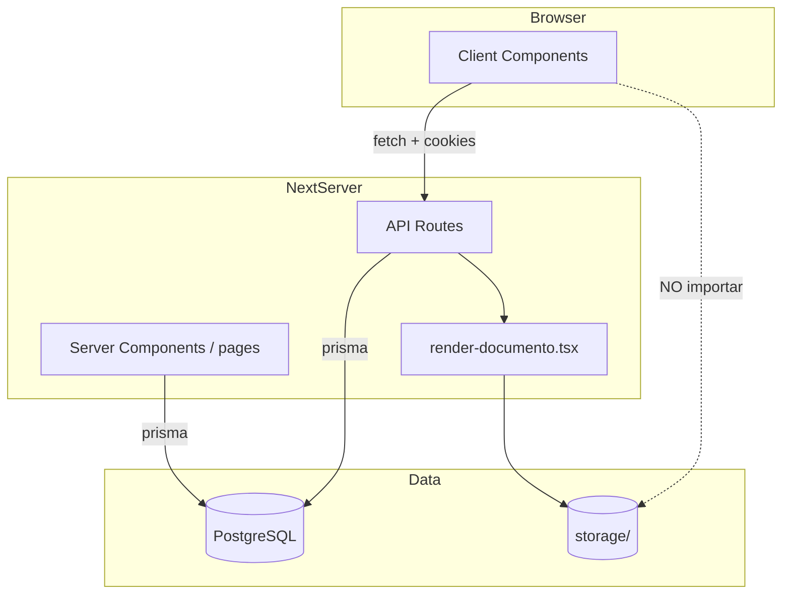

# 00 — Arquitectura implementada (estado actual)

> Actualizado para reflejar el **código en producción/dev**, no solo diseño.

## 1. Stack real

| Capa | Tecnología | Ubicación |
|------|------------|-----------|
| Frontend | Next.js 14 App Router, React 18, Tailwind | `app/(dashboard)/`, `components/` |
| API | Route handlers | `app/api/**/route.ts` |
| Auth | NextAuth 4, JWT con permisos RBAC | `lib/auth.ts`, `app/api/auth/` |
| ORM | Prisma 7 + `@prisma/adapter-pg` | `lib/prisma.ts`, `prisma/` |
| PDF | `@react-pdf/renderer` | `lib/plantillas/` |
| AFIP | `@afipsdk/afip.js` | `lib/afip/` |
| Storage | Local `./storage` (S3 pendiente) | `lib/storage.ts` |
| Colas | BullMQ + Redis (workers opcionales) | `worker/` |
| Leaflet | OpenStreetMap en sucursales y mapa ST | `components/clientes/SucursalMapPreview.tsx`, `/servicio-tecnico/mapa` |
| Validación | Zod 4 + locale ES | `lib/validation.ts`, `lib/zod-es.ts` |

## 2. Capas de la aplicación



### Middleware

- `middleware.ts`: protege rutas `(dashboard)/*` con NextAuth.
- **No** protege `/api/*` — cada handler valida sesión/permiso.
- Headers de seguridad: `X-Frame-Options: DENY` → previews PDF usan fetch+blob (`PdfPreviewFrame`).

## 3. Patrones transversales

### Autorización

```typescript
// API — siempre
await requirePermission('modulo.accion')
// o
await requireAuth() // solo sesión

// Página server — redirige si falta permiso
await requirePagePermission('modulo.accion')

// Cliente — solo UX (puede pasar puedeEditar desde server)
useCan('modulo.accion')
```

### Serialización Prisma → JSON

- `plain()` en `lib/serialize.ts` — Decimal→number, Date→ISO, redacción de secretos.
- Usar en respuestas API; no enviar objetos Prisma crudos al cliente.

### Errores

- `handleApiError(error)` — Zod, Prisma, `ApiError`, 500 genérico **en español**.
- Cliente: `mensajeErrorRespuesta`, `mensajeErrorDesconocido` desde `lib/errores.ts`.

### Auditoría

- `registrarAuditoria()` en mutaciones sensibles (usuarios, plantillas, emisores, etc.).

## 4. Módulos implementados (UI + API)

| Módulo | Rutas UI | API base | Estado |
|--------|----------|----------|--------|
| Dashboard | `/dashboard` | `/api/dashboard` | ✅ |
| Clientes | `/crm`, `/crm/nuevo`, `/crm/[id]` | `/api/clientes`, `/api/clientes/[id]/sucursales`, `/api/geocoding` | ✅ |
| Presupuestos | `/presupuestos` | `/api/presupuestos` | ✅ |
| Facturación | `/facturacion` | `/api/facturas` | ✅ (+ AFIP parcial) |
| Cobranzas | `/cobranzas` | `/api/cobranzas` | ✅ |
| Inventario | `/inventario` | `/api/inventario` | ✅ |
| Compras | `/compras` | `/api/ordenes-compra` | ✅ |
| Proveedores | `/proveedores` | `/api/proveedores` | ✅ |
| Servicio técnico | `/servicio-tecnico` | `/api/ots`, `/api/equipos` | ✅ |
| Tracking / mapa | `/servicio-tecnico/mapa` | `/api/tracking` | ✅ |
| Preventivo | `/servicio-tecnico/preventivo` | `/api/mantenimiento` | ✅ |
| CRM inbox | `/crm/inbox` | `/api/crm/conversaciones`, `/api/clientes/[id]/historial` | ✅ |
| CRM embudo | `/crm/embudo` | `/api/crm/embudo` | ✅ |
| Contabilidad AR | `/configuracion/contabilidad` | `/api/contabilidad/*` | ✅ |
| Plantillas PDF | `/configuracion/plantillas` | `/api/plantillas/*` | ✅ |
| Emisores AFIP | `/configuracion/emisores` | `/api/emisores` | ✅ |
| Usuarios | `/configuracion/usuarios` | `/api/usuarios` | ✅ |
| Integraciones | `/configuracion/integraciones` | `/api/integraciones/*` | ✅ |
| n8n | — | `/api/n8n/*` (API key) | ✅ |
| Webhooks | — | `/api/webhooks/*` | ✅ |

## 5. Entorno y despliegue local

Ver `.env.local.example`. Mínimo: `DATABASE_URL`, `NEXTAUTH_SECRET`, `NEXTAUTH_URL`.

Workers separados (opcional en dev):

```bash
npm run worker:afip
npm run worker:crm-email
npm run worker:cobranzas
```

## 6. Estabilidad en desarrollo

Ver [`DEV-ESTABILIDAD.md`](DEV-ESTABILIDAD.md). Síntoma típico: UI sin CSS → `npm run dev:reset`.

Tests: `npm run smoke`, `npm run e2e`, `npm run e2e:all` (ver [`DEV-ESTABILIDAD.md`](DEV-ESTABILIDAD.md)).

## 7. Documentos relacionados

- [`11-API-ENDPOINTS.md`](11-API-ENDPOINTS.md)
- [`12-PLANTILLAS-PDF.md`](12-PLANTILLAS-PDF.md)
- [`13-FLUJOS-COMERCIALES.md`](13-FLUJOS-COMERCIALES.md)
- [`14-CONTRATOS-FRONTERAS.md`](14-CONTRATOS-FRONTERAS.md)
- [`15-ESTADOS-WORKERS-SEGURIDAD.md`](15-ESTADOS-WORKERS-SEGURIDAD.md)
- [`../AGENTS.md`](../AGENTS.md)
