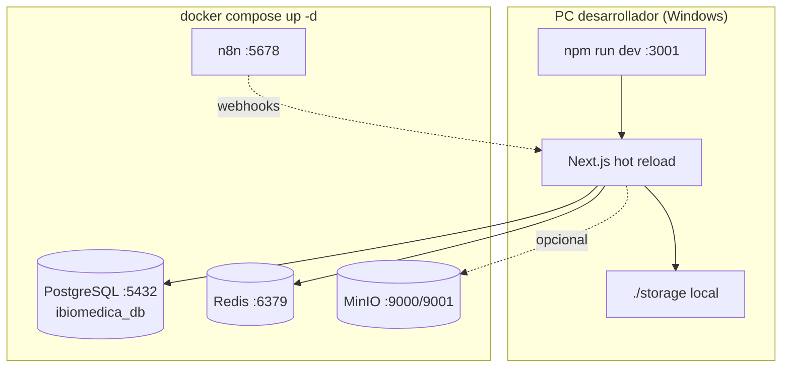
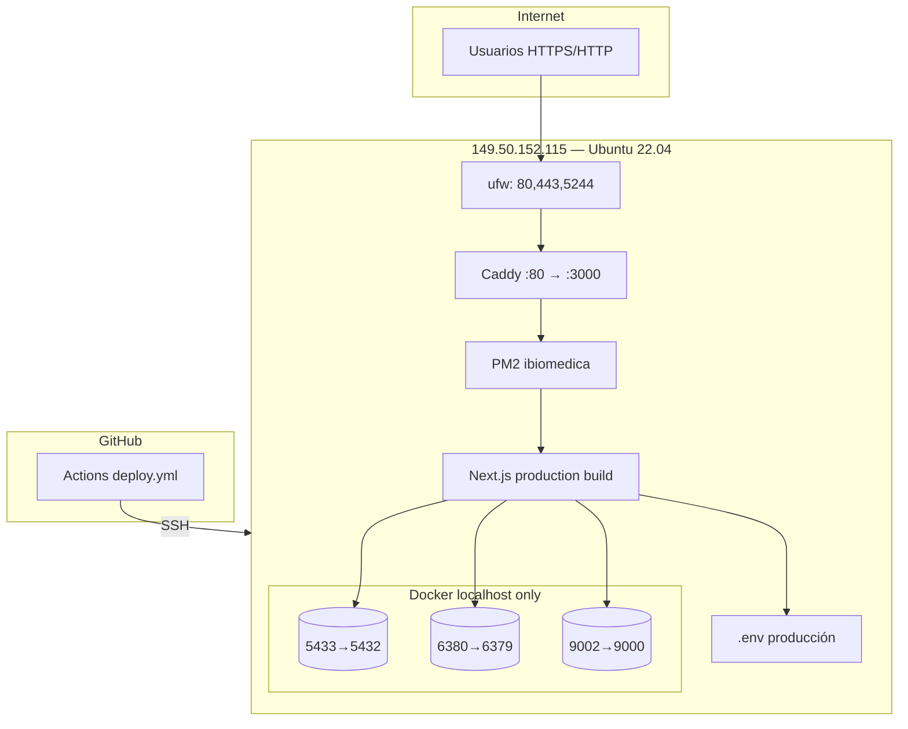
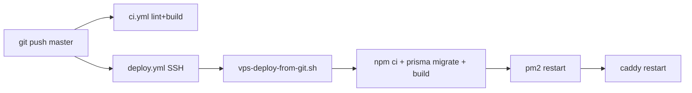
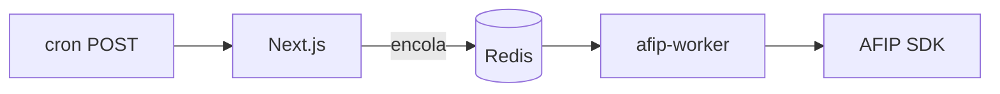
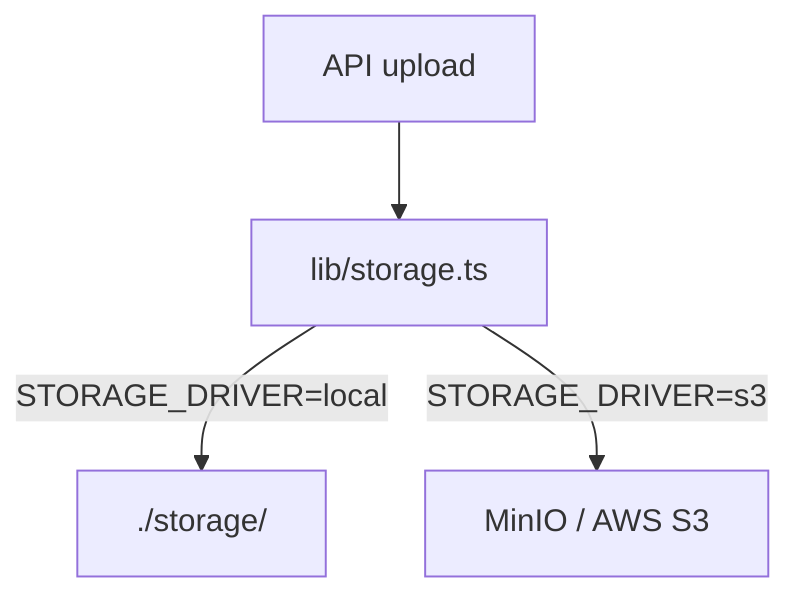

# 00 — Infraestructura (desarrollo y producción)

> **Documento canónico** de infraestructura. Complementa [`16-DESPLIEGUE-PRODUCCION.md`](16-DESPLIEGUE-PRODUCCION.md) (checklist operativo).

---

## 1. Diagrama desarrollo local



### Servicios Docker (dev)

| Servicio | Puerto host | Credencial default | Uso |
|----------|-------------|-------------------|-----|
| postgres | 5432 | admin / admin123 | BD principal |
| redis | 6379 | — | BullMQ AFIP |
| minio | 9000, 9001 | admin / admin123456 | S3 dev |
| n8n | 5678 | admin / admin123 | Automatizaciones |

**Archivo:** `docker-compose.yml`  
**Variables:** `.env` (gitignored), plantilla `.env.local.example`

### Comandos dev

```bash
docker compose up -d          # Infra
cp .env.local.example .env    # Primera vez
npm install
npx prisma migrate deploy
npm run db:seed
npm run dev                   # Puerto PORT en .env (default 3001)
```

Ver [`DEV-ESTABILIDAD.md`](DEV-ESTABILIDAD.md) si CSS roto o Prisma desincronizado → `npm run dev:reset`.

---

## 2. Diagrama producción (VPS DonWeb)



### Rutas y paths producción

| Elemento | Valor |
|----------|-------|
| App directory | `/opt/ibiomedica` |
| Process manager | PM2 `ibiomedica` → `npm start` |
| Reverse proxy | Caddy `/etc/caddy/Caddyfile` |
| URL actual | `http://149.50.152.115` |
| SSH | puerto `5244`, usuario `root` |
| Branch deploy | `master` |

### Puertos remapeados (prod)

El VPS tiene conflictos en puertos estándar. `docker-compose.prod.yml` (generado en deploy):

| Servicio | Host | Container |
|----------|------|-----------|
| PostgreSQL | 127.0.0.1:5433 | 5432 |
| Redis | 127.0.0.1:6380 | 6379 |
| MinIO | 127.0.0.1:9002/9003 | 9000/9001 |

**DATABASE_URL** en prod debe usar `:5433`.

---

## 3. CI/CD GitHub Actions



| Workflow | Archivo | Trigger | Estado esperado |
|----------|---------|---------|-----------------|
| CI | `.github/workflows/ci.yml` | push/PR master | lint + build |
| Deploy | `.github/workflows/deploy.yml` | push master | SSH deploy VPS |

### Secretos GitHub (repo Settings → Secrets)

| Secreto | Descripción |
|---------|-------------|
| `VPS_HOST` | IP del VPS |
| `VPS_PORT` | SSH (5244 DonWeb) |
| `VPS_USER` | root |
| `VPS_SSH_KEY` | Clave privada ed25519 deploy |

### Script de deploy en VPS

`scripts/vps-deploy-from-git.sh`:
1. `git fetch && git reset --hard origin/master`
2. Regenera `docker-compose.prod.yml`
3. `docker compose up -d` postgres redis minio
4. `npm ci`, `prisma migrate deploy`, `npm run build`
5. `pm2 restart ibiomedica`
6. Reinicia Caddy

---

## 4. Workers y procesos background

| Proceso | Comando | Depende de | Propósito |
|---------|---------|------------|-----------|
| App web | PM2 `ibiomedica` | PG | UI + API |
| AFIP worker | `npm run worker:afip` | Redis, PG | Cola emisión fiscal |
| CRM email | `npm run worker:crm-email` | PG, IMAP config | Ingesta email |
| CRM Graph | `npm run worker:crm-graph` | PG, OAuth MS | Ingesta Outlook |
| Cobranzas | `npm run worker:cobranzas` o cron HTTP | PG | Vencimientos |
| Alquiler equipos | cron HTTP `POST /api/cron/alquiler-cuotas` | PG | Cuotas mensuales + marcar vencidas |

**Prod actual:** típicamente solo PM2 app. Workers deben levantarse aparte o vía cron HTTP (`/api/cron/*` + `CRON_SECRET` en `.env`).

### Cron HTTP (`/api/cron/*`)

Todas las rutas exigen `Authorization: Bearer $CRON_SECRET`. Instalación en VPS: `sudo APP_URL=https://erp-ibiomedica.com.ar bash scripts/vps-install-cron.sh` → genera `/etc/cron.d/ibiomedica-cron`.

| Endpoint | Horario (VPS) | Qué hace |
|----------|---------------|----------|
| `POST /api/cron/ots-vencidas` | Cada hora | OTs con SLA vencido → `VENCIDA` |
| `POST /api/cron/presupuestos-vencidos` | 05:00 | Presupuestos con vigencia vencida |
| `POST /api/cron/cobranzas-vencimientos` | 06:00 | Vencimientos facturas + avisos cobranza |
| `POST /api/cron/alquiler-cuotas` | **06:15** | Genera cuotas del mes (contratos ACTIVOS) + marca cuotas vencidas |
| `POST /api/cron/notificaciones-operativas` | 06:30 | Email preventivo + CRM sin respuesta 2 h |
| `POST /api/cron/stock-minimo` | 07:00 | Alertas stock bajo |
| `POST /api/cron/resumen-semanal` | Dom 08:00 | Email KPIs admin |

**Alquiler (`alquiler-cuotas`):** idempotente — no duplica cuotas (`lineaId` + `periodo` únicos). Solo contratos en estado `ACTIVO`; los `SUSPENDIDO` no reciben cuotas nuevas. Corre **después** de cobranzas (06:00) para que facturas y cuotas de alquiler sigan el mismo ciclo diario.

Probar manualmente en prod:

```bash
set -a; source /opt/ibiomedica/.env; set +a
curl -sf -X POST "https://erp-ibiomedica.com.ar/api/cron/alquiler-cuotas" \
  -H "Authorization: Bearer $CRON_SECRET"
# Respuesta esperada: {"ok":true,"periodo":"2026-06","creadas":0,"cuotasMarcadasVencidas":0}
```

Alternativa local (sin HTTP): `cd /opt/ibiomedica && npm run cron:alquiler-cuotas`

Log del job: origen `cron-alquiler-cuotas` en **Configuración → Logs** (nivel INFO).



---

## 5. Almacenamiento de archivos



| Tipo archivo | Ruta típica |
|--------------|-------------|
| Avatares | `storage/avatars/` |
| Certificados AFIP | storage vía `Emisor.certificadoPath` |
| Imágenes plantilla | `storage/plantillas/` |
| PDF generados | stream al cliente (no siempre persistido) |

**Regla:** `storage/` está en `.gitignore`.

---

## 6. Red y seguridad perimetral

| Capa | Dev | Prod |
|------|-----|------|
| Firewall | localhost | ufw 80,443,5244 |
| TLS | No | Caddy + Let's Encrypt (`scripts/vps-caddy-apply.sh`) |
| DB expuesta | localhost:5432 | 127.0.0.1:5433 only |
| Headers | next.config + lib/security | Igual |

---

## 7. Scripts VPS (índice)

| Script | Cuándo usar |
|--------|-------------|
| `vps-setup-github-deploy.sh` | Setup inicial CI/CD |
| `vps-deploy-from-git.sh` | Cada deploy (automático vía GA) |
| `vps-bootstrap.sh` | Primera instalación bare metal |
| `vps-health-check.sh` | Verificar PM2, Docker, HTTP |
| `vps-fix-caddy.sh` | Reparar Caddyfile multiline |
| `vps-run-remote.sh.js` | Ejecutar script remoto desde Windows |

**No usar** `vps-deploy-remote.js` para deploys rutinarios (sube tarball; reemplazado por git pull).

---

## 8. Variables de entorno críticas

| Variable | Obligatoria | Secreto |
|----------|-------------|---------|
| `DATABASE_URL` | ✅ | ✅ |
| `NEXTAUTH_SECRET` | ✅ | ✅ |
| `NEXTAUTH_URL` | ✅ | No |
| `REDIS_URL` | Workers AFIP | No |
| `CRON_SECRET` | Cron prod | ✅ |
| `N8N_API_KEY` | API n8n | ✅ |
| `INTEGRATION_SECRET` | Cifrado canales | ✅ |
| `S3_*` | Storage S3 | ✅ |

Plantilla: `.env.local.example` — **nunca** commitear `.env`.

---

## 9. Backups recomendados (operación)

```bash
# PostgreSQL dump (en VPS)
docker exec ibiomedica_db pg_dump -U admin ibiomedica_db > backup.sql

# .env (fuera de git)
cp /opt/ibiomedica/.env /root/backups/.env.$(date +%F)
```

Programar cron diario en VPS; retener 7–30 días.

---

## 10. Health checks

| Endpoint / comando | Esperado |
|--------------------|----------|
| `GET /login` | 200 |
| `GET /api/health` | 200 `{"ok":true}` |
| `docker exec ibiomedica_db pg_isready` | accepting |
| `pm2 status` | ibiomedica online |
| `npx prisma migrate status` | up to date |
