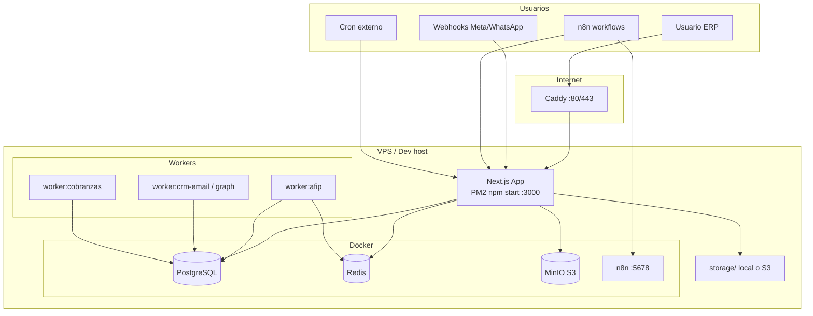
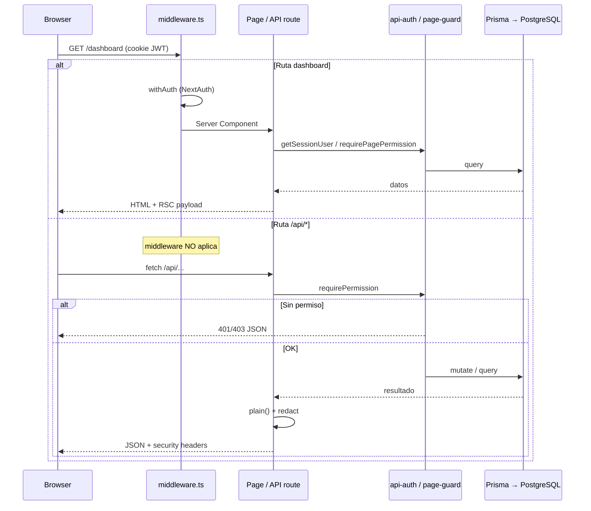
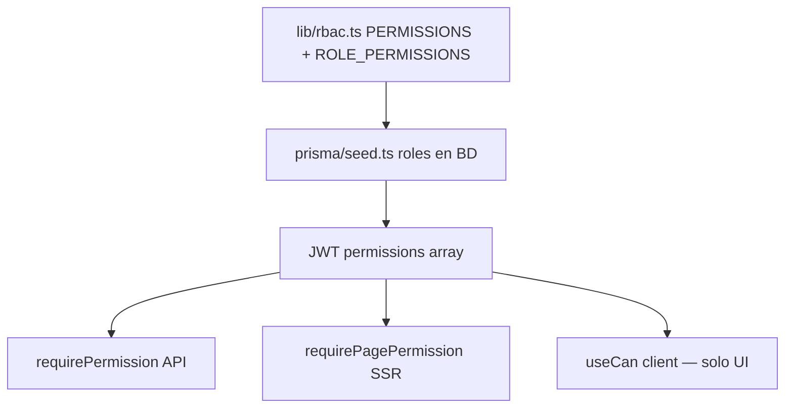
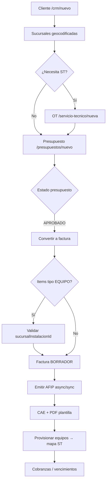
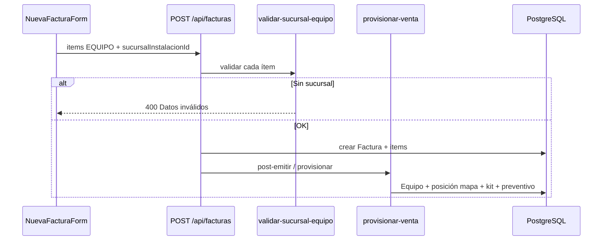
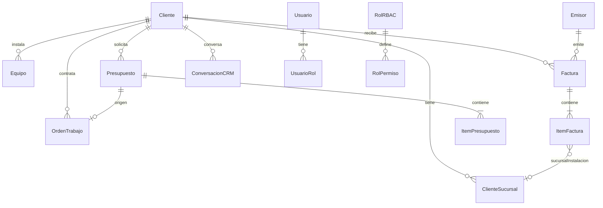
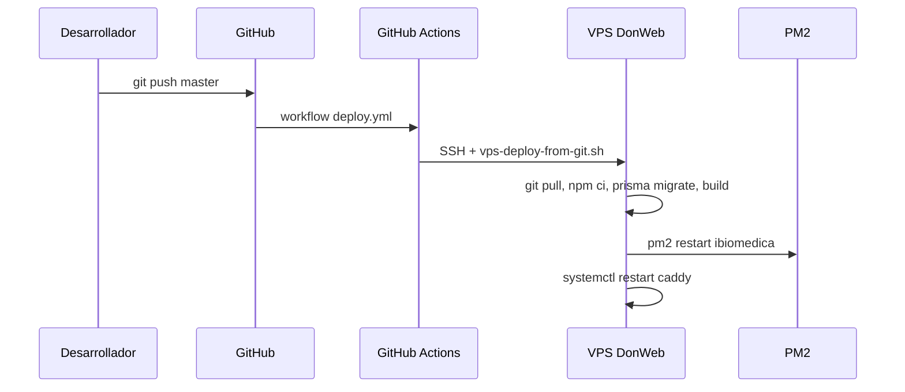

# 00 — Sistema punta a punta

> **Documento canónico** de flujos end-to-end. Diagramas + puntos de extensión seguros.  
> Leer junto con [`AI-MASTER.md`](AI-MASTER.md).

---

## 1. Vista general del sistema



---

## 2. Request HTTP — ciclo de vida



### Puntos de extensión seguros

| Capa | Archivo | Al agregar feature |
|------|---------|-------------------|
| Protección página | `middleware.ts` matcher | Solo si es ruta dashboard nueva |
| Permiso página | `lib/page-guard.ts` | `requirePagePermission('x.y')` al inicio del page |
| API | `app/api/.../route.ts` | `requirePermission` + Zod + `handleApiError` |
| Permiso nuevo | `lib/rbac.ts` + seed | Clave `modulo.accion` |

---

## 3. Autenticación y sesión

```mermaid
flowchart LR
  subgraph Login
    L[/login page/]
    NA[NextAuth CredentialsProvider]
    RL[login-rate-limit Redis/mem]
    BC[bcrypt compare]
  end

  subgraph Token
    JWT[JWT cookie httpOnly]
    PERM[roles + permissions[]]
  end

  subgraph Política
    PS[(PoliticaSeguridad<br/>sesionMaxHoras)]
  end

  L --> NA --> RL --> BC
  BC -->|OK| JWT
  NA --> PERM
  PS --> JWT
  JWT -->|maxAge sin sliding| Exp[Expira absoluto]
```

**Archivos:** `lib/auth.ts`, `lib/auth/login-rate-limit.ts`, `app/api/auth/[...nextauth]/route.ts`

**Reglas:**
- Permisos se calculan **al login** y viajan en JWT (no ir a BD en cada request de permiso).
- Cambiar roles requiere **re-login** o `session.update` explícito.
- Producción debe usar **HTTPS** para proteger la cookie.

---

## 4. RBAC — tres capas



| Capa | Seguridad real | Bypass posible |
|------|----------------|----------------|
| API | ✅ Sí | No — siempre validar |
| SSR page | ⚠️ Parcial | Usuario autenticado puede ver HTML si falta guard |
| Client UX | ❌ No | F12 / fetch directo a API |

**Deuda conocida:** no todas las páginas usan `requirePagePermission`; la API sí bloquea mutaciones.

---

## 5. Flujo comercial principal



**Archivos clave:**

| Paso | lib/ / app/ |
|------|-------------|
| Alta cliente | `lib/clientes/crear-cliente.ts`, `components/clientes/SucursalesEditor.tsx` |
| Presupuesto | `app/api/presupuestos/` |
| Convertir | `app/api/presupuestos/[id]/convertir/route.ts` |
| Sucursal equipo | `lib/facturas/validar-sucursal-equipo.ts` |
| AFIP | `lib/afip/emitir.ts`, `worker/afip-worker.ts` |
| PDF | `lib/plantillas/render-documento.tsx` |
| Provisión | `lib/equipos/provisionar-venta.ts` |
| Cobranzas | `lib/cobranzas/`, cron/worker |

**Estados:** ver [`15-ESTADOS-WORKERS-SEGURIDAD.md`](15-ESTADOS-WORKERS-SEGURIDAD.md)

---

## 6. Venta de equipo (inventario → cliente → mapa)



---

## 7. CRM omnicanal

```mermaid
flowchart LR
  subgraph Entrada
    IMAP[IMAP poll worker]
    GRAPH[Graph poll worker]
    WA[Webhook WhatsApp]
    META[Webhook Meta]
    N8N[n8n crear-lead]
  end

  subgraph Core
    ING[lib/crm/ingest]
    CONV[(ConversacionCRM)]
    MSG[(MensajeCRM)]
  end

  subgraph Salida
    INBOX[/crm/inbox UI]
    EMB[/crm/embudo kanban]
    HIST[Historial cliente OT+facturas]
  end

  IMAP --> ING
  GRAPH --> ING
  WA --> ING
  META --> ING
  N8N -->|API key| CONV
  ING --> CONV --> MSG
  CONV --> INBOX
  CONV --> EMB
  CONV --> HIST
```

**Seguridad webhooks:** firma HMAC obligatoria si hay `appSecret` configurado.

---

## 8. Facturación AFIP

```mermaid
flowchart TD
  UI[Emitir factura] --> API[POST /api/facturas/id/emitir]
  API --> Q{BullMQ disponible?}
  Q -->|Sí| REDIS[Cola afip-emision]
  REDIS --> W[afip-worker.ts]
  Q -->|No| SYNC[emitir sync en API]
  W --> AFIP[@afipsdk/afip.js]
  SYNC --> AFIP
  AFIP --> DB[(Factura.estado + CAE)]
  DB --> PDF[Generar PDF]
```

**Regla:** en ambiente PRODUCCION no debe emitir CAE simulado (ver `lib/afip/client.ts`).

---

## 9. Plantillas PDF

```mermaid
flowchart LR
  ED[Editor visual /configuracion/plantillas]
  DB[(PlantillaImpresion JSON layout)]
  PRE[Preview queue GET]
  REN[render-documento.tsx]
  PDF[@react-pdf/renderer]
  OUT[PDF bytes → usuario]

  ED --> DB
  PRE --> REN --> PDF --> OUT
```

**Reglas:** una plantilla `predeterminado: true` por tipo (`FACTURA`, `PRESUPUESTO`, etc.).

---

## 10. Observabilidad

```mermaid
flowchart TB
  subgraph Negocio
    AUD[registrarAuditoria]
    AL[(AuditLog)]
    UI1[/configuracion/auditoria]
  end

  subgraph Técnico
    HAE[handleApiError]
    SL[(SystemLog)]
    UI2[/configuracion/logs]
    PURGE[logs:purge 15 días]
  end

  API[Mutaciones API] --> AUD --> AL --> UI1
  API --> HAE --> SL --> UI2
  PURGE --> SL
```

---

## 11. Modelo de datos — clusters



**Fuente completa:** `prisma/schema.prisma` (58 modelos).

---

## 12. Deploy CI/CD



Ver [`00-INFRAESTRUCTURA.md`](00-INFRAESTRUCTURA.md) y [`16-DESPLIEGUE-PRODUCCION.md`](16-DESPLIEGUE-PRODUCCION.md).

---

## 13. Checklist al modificar un flujo

1. Identificar entidades Prisma afectadas y estados válidos (doc 15).
2. Verificar permisos en **API** y ideally en **página**.
3. Validar con Zod en API; en cliente usar `*-client.ts` si comparte reglas.
4. Usar transacciones Prisma si hay múltiples writes relacionados.
5. Registrar auditoría en mutaciones sensibles.
6. Probar smoke/e2e del módulo si existe cobertura.
7. Actualizar doc canónico del módulo (ver `00-INDICE-CANONICO.md`).
