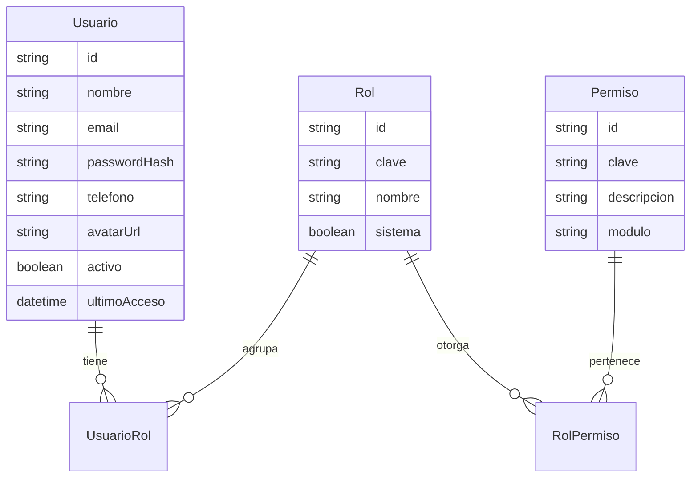
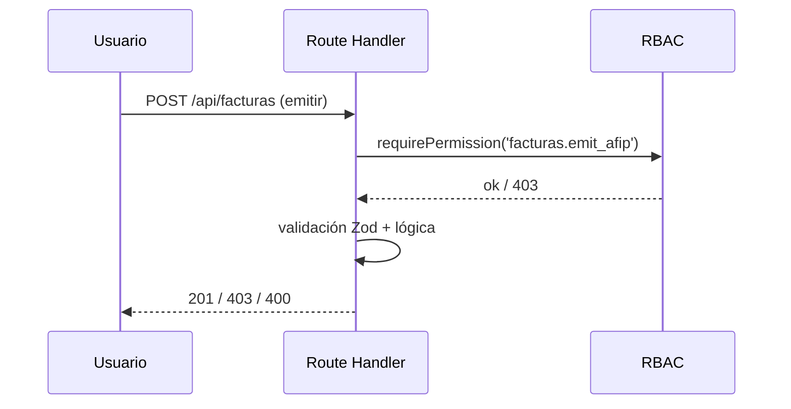

# 01 · Roles y Permisos (RBAC)

## Objetivo

Modelar permisos **granulares por acción** y permitir que un usuario tenga
**varios roles a la vez** (el organigrama real lo exige). Solo Administrador y
Gerente pueden dar de alta usuarios; cualquiera puede editar su propio perfil.

**Fuente de verdad en código:** `lib/rbac.ts` (`PERMISSIONS`, `ROLE_PERMISSIONS`).

Post-deploy (permisos nuevos sin pisar custom UI): `npx tsx --env-file=.env scripts/sync-permisos-post-deploy.ts`.

---

## 1. Organigrama actual → roles del sistema

| Persona            | Función real                                   | Roles asignados                               |
| ------------------ | ---------------------------------------------- | --------------------------------------------- |
| Leandro Mongelos   | Administrador del sistema                       | `SUPERADMIN`                                  |
| Cesar Ramirez      | Gerente                                         | `GERENTE`                                     |
| Guillermo Aquiles  | Administración / Ventas / Facturación           | `ADMINISTRACION`, `VENTAS`, `FACTURACION`     |
| Lucas Alloi        | Facturación / Contabilidad / Ventas            | `FACTURACION`, `CONTABILIDAD`, `VENTAS`       |
| Nicolás            | Servicio Técnico / Ventas                       | `TECNICO`, `VENTAS`                           |
| Joaquín            | Servicio Técnico / Ventas                       | `TECNICO`, `VENTAS`                           |
| Leonardo           | Servicio Técnico / Ventas                       | `TECNICO`, `VENTAS`                           |

> Los permisos efectivos de un usuario son la **unión** de los permisos de todos
> sus roles.

---

## 2. Modelo conceptual

Se elige **RBAC con permisos explícitos** (no solo enum de rol) porque:
- Un usuario necesita combinar funciones.
- Mañana querés un rol nuevo ("Logística") sin tocar código.
- Permite permisos finos: ver vs. crear vs. aprobar vs. anular.

---

## 3. Catálogo de permisos (clave `modulo.accion`)

Sincronizado con `lib/rbac.ts` (jun 2026).

| Módulo         | Permisos |
| -------------- | -------- |
| `usuarios`     | `read`, `create`, `update`, `deactivate`, `assign_roles` |
| `perfil`       | `edit_own` |
| `clientes`     | `read`, `create`, `update`, `deactivate`, `export` |
| `proveedores`  | `read`, `create`, `update`, `deactivate` |
| `presupuestos` | `read`, `create`, `update`, `send`, `approve`, `delete` |
| `facturas`     | `read`, `create`, `emit_afip`, `cancel`, `credit_note`, `export` |
| `cobranzas`    | `read`, `register_payment`, `reconcile`, `cheques.read`, `cheques.manage` |
| `inventario`   | `read`, `create`, `update`, `adjust_stock`, `transfer` |
| `compras`      | `read`, `create`, `approve`, `receive` |
| `servicio`     | `read`, `create`, `update`, `close`, `assign` |
| `preventivo`   | `read`, `schedule`, `complete` |
| `tracking`     | `read`, `create` |
| `crm`          | `read`, `reply`, `assign`, `manage_channels` |
| `reportes`     | `read_comercial`, `read_financiero`, `read_operativo`, `read_fiscal` |
| `emisores`     | `read`, `create`, `update`, `delete` |
| `config`       | `read`, `update`, `manage_accounting`, `manage_integrations`, `manage_billing_templates` |
| `auditoria`    | `read` |
| `logs`         | `read` |
| `listas_precios` | `read`, `manage` |

`SUPERADMIN` tiene comodín `*` (todos los permisos).

---

## 4. Matriz Rol × Permiso (resumen)

| Permiso \ Rol | SUPER | GER | ADM | VEN | FACT | CONT | TEC |
| --- | :-: | :-: | :-: | :-: | :-: | :-: | :-: |
| usuarios.create / assign_roles | ✅ | ✅ | ❌ | ❌ | ❌ | ❌ | ❌ |
| clientes.create/update | ✅ | ✅ | ✅ | ✅ | ❌ | ❌ | ❌ |
| clientes.export | ✅ | ✅ | ✅ | ❌ | ❌ | ❌ | ❌ |
| proveedores.* | ✅ | ✅ | ✅ | 👁️ | ❌ | 👁️ | 👁️ |
| presupuestos.approve | ✅ | ✅ | ✅ | ❌ | ❌ | ❌ | ❌ |
| facturas.emit_afip | ✅ | ✅ | ✅ | ❌ | ✅ | ✅ | ❌ |
| facturas.cancel / credit_note | ✅ | ✅ | ❌ | ❌ | ✅ | ✅ | ❌ |
| cobranzas.register_payment | ✅ | ✅ | ✅ | ❌ | ✅ | ✅ | ❌ |
| cobranzas.reconcile | ✅ | ✅ | ❌ | ❌ | ✅ | ✅ | ❌ |
| cobranzas.cheques.* | ✅ | ✅ | ✅ | ❌ | ✅ | ✅ | ❌ |
| inventario.adjust_stock | ✅ | ✅ | ✅ | ❌ | ❌ | ❌ | ✅ |
| inventario.transfer | ✅ | ✅ | ❌ | ❌ | ❌ | ❌ | ❌ |
| compras.approve | ✅ | ✅ | ✅ | ❌ | ❌ | ✅ | ❌ |
| servicio.* (full) | ✅ | ✅ | 👁️ | parcial | ❌ | ❌ | ✅ |
| preventivo.schedule | ✅ | ✅ | ✅ | ✅ | ❌ | ❌ | ✅ |
| tracking.* | ✅ | ✅ | 👁️ | ✅ | ❌ | ❌ | ✅ |
| crm.reply | ✅ | ✅ | ✅ | ✅ | ✅ | ❌ | ✅ |
| crm.assign | ✅ | ✅ | ✅ | ✅ | ❌ | ❌ | ❌ |
| config.manage_integrations | ✅ | ✅ | ❌ | ❌ | ❌ | ❌ | ❌ |
| reportes.read_financiero / fiscal | ✅ | ✅ | ✅ | ❌ | ✅ | ✅ | ❌ |
| emisores.create | ✅ | ✅ | ❌ | ❌ | ❌ | ✅ | ❌ |
| config.read / manage_accounting | ✅ | ✅/parcial | ❌ | ❌ | ❌ | ✅ | ❌ |
| auditoria.read / logs.read | ✅ | ✅ | ❌ | ❌ | ❌ | ❌ | ❌ |
| listas_precios.manage | ✅ | ✅ | ❌ | ❌ | ❌ | ❌ | ❌ |

> 👁️ = solo lectura donde aplica. Matriz editable en Configuración → Roles (`config.update`).

---

## 5. Aplicación técnica

- **Sesión**: el JWT de NextAuth incluye `userId` y el **set de permisos**
  resuelto al loguear (cacheado). Se recalcula al cambiar roles.
- **Backend**: helper `requirePermission('facturas.emit_afip')` reemplaza al
  actual `requireRole`. Sigue existiendo `requireAuth`.
- **Frontend**: hook `useCan('clientes.create')` para mostrar/ocultar botones, y
  guards de ruta. **La UI nunca es la única defensa**: el permiso se revalida en
  el endpoint.
- **Middleware**: protege segmentos del panel; el detalle fino se valida por acción.

---

## 6. Gestión de usuarios y perfil

- **Alta de usuario** (`usuarios.create`, solo SUPERADMIN/GERENTE): nombre,
  email, roles, estado. Se envía email de invitación con link para fijar
  contraseña (no se setea contraseña a mano).
- **Editar perfil propio** (`perfil.edit_own`, todos): nombre visible, teléfono,
  avatar, contraseña (con verificación de la actual), preferencias (idioma,
  notificaciones). **No** puede cambiar sus propios roles.
- **Seguridad**: política de contraseñas, bloqueo tras N intentos, registro de
  `ultimoAcceso` e historial de sesiones.
- **2FA (TOTP)**: **fuera de alcance** en esta versión del ERP. No hay flujo de
  enrolamiento ni validación en login; documentado para evitar confusión con la
  política de seguridad futura.
- Toda acción sobre usuarios queda en `AuditLog`.

---

## 7. Permisos cruzados (implementado)

| Acción | Permisos aceptados |
|--------|-------------------|
| Crear sucursal desde ficha cliente | `clientes.update` |
| **Carga rápida de sucursal al facturar** | `clientes.update` **o** `facturas.create` |
| Ver historial cliente (bandeja CRM) | `crm.read` **o** `clientes.read` |
| Vincular conversación a cliente (solo `clienteId`) | `crm.reply` |
| Listar facturas (cobranzas) | `facturas.read` **o** `cobranzas.read` |

Esto permite que facturación cree sedes de instalación sin permiso completo de edición de clientes, siempre que tenga `facturas.create`.
