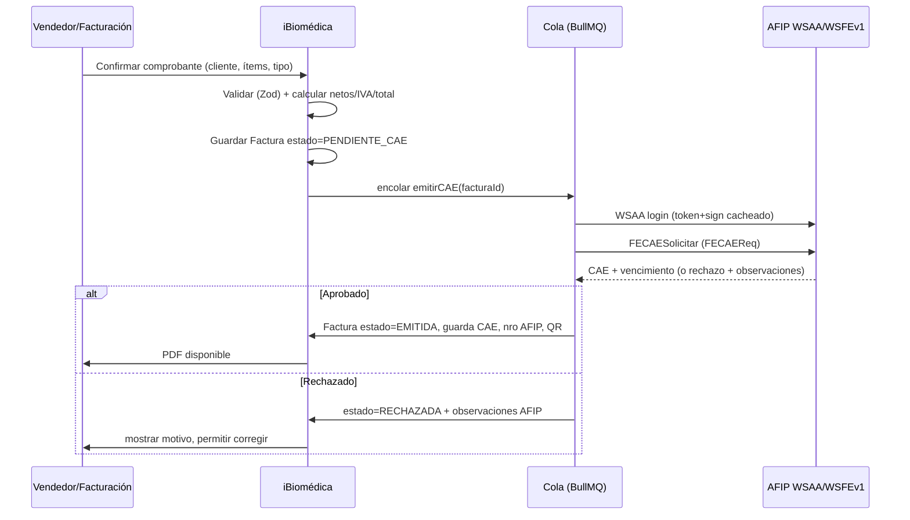
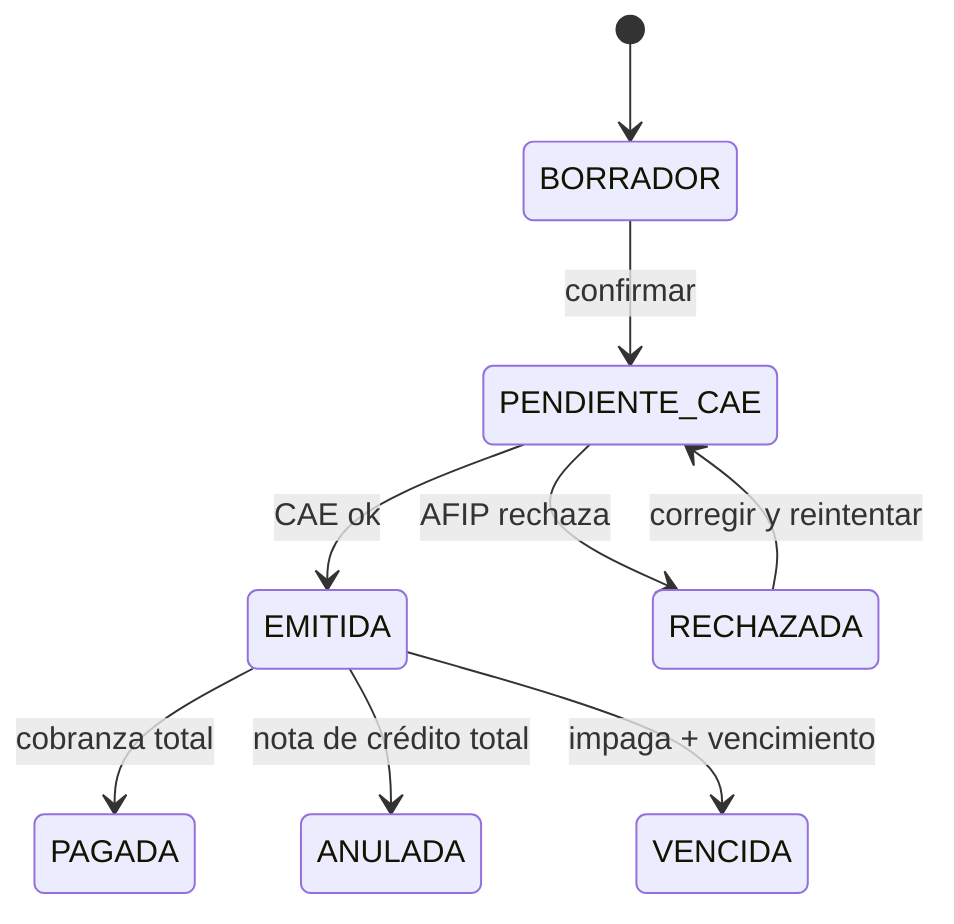
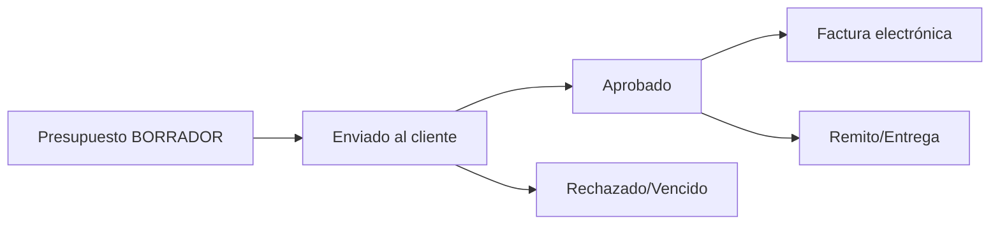
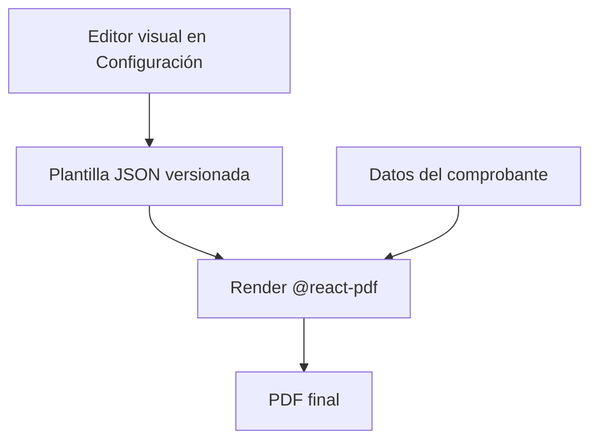

# 02 · Facturación + AFIP/ARCA

Cubre: configuración fiscal (lo que hay que cargar de ARCA/AFIP), el flujo de
emisión de comprobantes electrónicos con CAE, y el **motor de plantillas de
impresión 100% editable** (basado en el presupuesto real de la empresa).

> **Decisiones confirmadas:**
> - Integración AFIP con **`@afipsdk/afip.js`** propia (sin intermediario pago).
> - **Multi-emisor manual**: los CUIT/razones sociales se cargan a mano en
>   Configuración → Emisores (modelo `Emisor`). Cada comprobante elige con qué
>   emisor y punto de venta se emite, y qué plantilla usa. No se "hardcodea"
>   ninguna CUIT.

---

## ✅ Implementado — sucursal antes de provisión

Al facturar un **equipo** (`tipoArticulo = EQUIPO`):

1. La línea de factura exige **`sucursalInstalacionId`** (validación cliente + API).
2. Si el cliente no tiene la sede, se crea con **carga rápida** desde `NuevaFacturaForm`.
3. Al emitir AFIP o llamar `POST /api/facturas/[id]/provisionar-equipos`, `provisionarEquiposDesdeFactura` crea el `Equipo` con `sucursalId` → posición en mapa de servicio técnico.

Ver [`13-FLUJOS-COMERCIALES.md`](13-FLUJOS-COMERCIALES.md) §7 y [`03-clientes.md`](03-clientes.md).

---

## 1. Qué hay que cargar de ARCA / AFIP

Para emitir factura electrónica se necesita configurar **una vez** (en
Configuración → Emisores, ver doc 08):

### 1.1 Emisores (carga manual, multi-CUIT)

Cada **Emisor** se carga a mano y agrupa sus datos fiscales + certificados +
puntos de venta. Se pueden tener varios (ej. la persona física 20-... y la
sociedad 30-...) y elegir cuál usar al emitir.

| Dato                     | Ejemplo (del presupuesto)             |
| ------------------------ | ------------------------------------- |
| Razón social             | INGENIERIA BIOMEDICA                   |
| CUIT                     | 20-24440827-4 (Ingeniería Biomédica) |
| Condición frente al IVA  | Responsable Inscripto                  |
| Ingresos Brutos          | *cargable*                             |
| Inicio de actividades    | 01-08-2003                             |
| Domicilio comercial      | Eva Perón Nº679 - 3600 Formosa        |
| Contacto                 | Cel 3705 343364 · ingenieriabiomedica@hotmail.com |
| Certificado / clave AFIP | por emisor (cifrados)                  |
| Punto(s) de venta        | por emisor                             |
| Predeterminado           | uno marcado como default               |

### 1.2 Credenciales y parámetros AFIP (lo crítico)

| Ítem                         | Descripción                                                                 |
| ---------------------------- | -------------------------------------------------------------------------- |
| **Certificado digital (.crt)** | Se genera en AFIP (clave fiscal) para el servicio **WSFE - Facturación Electrónica**. |
| **Clave privada (.key)**     | Par del certificado. Se guarda **cifrada** en el storage seguro, nunca en el repo. |
| **Alias del certificado**    | Nombre con el que se registró en AFIP.                                      |
| **Punto de venta (PtoVta)**  | Habilitado en AFIP como "Web Services" (distinto al del talonario manual).  |
| **Ambiente**                 | `homologación` (testing) / `producción`.                                    |
| **Tipos de comprobante**     | Factura A/B/C, Nota de Crédito A/B/C, Nota de Débito, Recibo.               |
| **Conceptos**                | Productos / Servicios / Productos y Servicios.                              |
| **Alícuotas de IVA**         | 21%, 10.5%, 27%, 0%, exento.                                                |
| **Token/Sign WSAA**          | Se obtienen automáticamente con el certificado y se cachean ~12 h.          |

> **Pasos previos del contador/empresa en AFIP** (fuera del sistema):
> 1. Generar certificado para WSFE en homologación y producción.
> 2. Asociar el servicio WSFE a la relación de la CUIT.
> 3. Habilitar el punto de venta electrónico.
>
> El sistema solo necesita: **certificado, clave, CUIT, punto de venta y ambiente.**

### 1.3 Padrón (opcional pero recomendado)

Integrar **WS Padrón A13/A5** para autocompletar datos del cliente (razón social,
condición IVA, domicilio) a partir del CUIT.

---

## 2. Flujo de emisión electrónica (WSAA + WSFEv1)



Puntos clave:
- **Numeración**: AFIP devuelve el número; el sistema pide el último autorizado
  (`FECompUltimoAutorizado`) para evitar saltos.
- **CAE y vencimiento de CAE**: se persisten; el comprobante no es válido sin CAE.
- **QR fiscal**: se arma con el JSON base64 que exige AFIP (ver, fecha, cuit,
  ptoVta, tipoCmp, nroCmp, importe, moneda, ctz, tipoDocRec, nroDocRec, tipoCodAut,
  codAut) y se renderiza en el PDF.
- **Reintentos**: ante timeout de AFIP, la cola reintenta de forma idempotente
  (clave = facturaId + ptoVta + nro tentativo).
- **Contingencia**: si AFIP está caído, el comprobante queda `PENDIENTE_CAE` y se
  reprocesa; nunca se entrega un PDF "fiscal" sin CAE.

### Máquina de estados del comprobante



> Una factura **EMITIDA no se borra ni edita**: se corrige con **Nota de
> Crédito/Débito** (requisito fiscal).

---

## 3. Presupuesto → Factura

El presupuesto (documento no fiscal, como el PDF de ejemplo) es la antesala:



- El presupuesto reutiliza el **mismo motor de ítems y de plantilla** que la
  factura, pero **no** llama a AFIP y lleva la leyenda "documento no válido como
  factura" + "Vigencia: N días".
- Al aprobar, se puede convertir en factura (heredando ítems, cliente, vendedor,
  condiciones) en un clic.

---

## 4. Motor de plantillas de impresión (100% editable)

Requisito del cliente: **la impresión debe ser totalmente editable en todas sus
partes**, con **foto de producto opcional** y **largos de texto configurables**.

### 4.1 Enfoque

Una **plantilla** es un documento de configuración (JSON) versionado que define
secciones, columnas, etiquetas, límites de caracteres, tipografías, colores,
logo y qué bloques se muestran. El render usa `@react-pdf/renderer` leyendo esa
config. Así, cambiar la plantilla **no requiere tocar código**.



### 4.2 Bloques configurables (mapeados al presupuesto real)

| Bloque                | Configurable                                                              |
| --------------------- | ------------------------------------------------------------------------ |
| **Encabezado emisor** | Logo (subir/posición/tamaño), razón social, CUIT, IIBB, inicio activ., domicilio, contacto, leyenda. |
| **Tipo de documento** | "FACTURA A/B/C" o "PRESUPUESTO Nº..." + leyenda "documento no válido como factura". |
| **Datos del cliente** | Mostrar/ocultar y reordenar: Cliente, Dirección, Dir. de entrega, CUIT, Situac. IVA, Depósito, Entrega, Vendedor, Orden de compra, Cond. de pago. |
| **Tabla de ítems**    | Columnas on/off y orden: Código, Descripción, **Foto**, Cantidad, Precio unit., Bonif., Subtotal. Ancho de cada columna. |
| **Descripción larga** | Límite de caracteres por ítem configurable (ej. 600), wrap, fuente. |
| **Foto de producto**  | **Opcional por ítem**; tamaño/relación de aspecto; si no hay, la columna colapsa. |
| **Totales**           | SubTotal, SubTotal Neto, Bonificación, IVA discriminado (según tipo), Total. |
| **Importe en letras** | "Son pesos ..." (util `numeroALetras`). On/off. |
| **Observaciones**     | Texto libre + campos: Vigencia, Forma de pago, Plazo de entrega, Garantía. |
| **Pie / fiscal**      | CAE, Vto CAE, QR AFIP, código de barras, leyendas legales. |
| **Estilo global**     | Tipografía, tamaños, color de marca, márgenes, papel A4/Carta, idioma. |

### 4.3 Esquema de la plantilla (resumen)

```jsonc
{
  "id": "plantilla-factura-default",
  "version": 3,
  "tipo": "FACTURA",          // FACTURA | PRESUPUESTO | REMITO | NC | ND
  "papel": "A4",
  "estilo": { "fuente": "Inter", "colorMarca": "#E8650A", "margenMm": 14 },
  "encabezado": {
    "logo": { "url": "...", "ancho": 120, "alineacion": "left" },
    "campos": ["razonSocial","cuit","iibb","inicioActividades","domicilio","contacto"],
    "leyenda": ""
  },
  "cliente": {
    "campos": ["nombre","direccion","direccionEntrega","cuit","situacionIva",
               "deposito","entrega","vendedor","ordenCompra","condicionPago"]
  },
  "items": {
    "columnas": [
      { "key": "codigo",      "label": "Producto",   "visible": true,  "anchoPct": 12 },
      { "key": "descripcion", "label": "Descripción","visible": true,  "anchoPct": 40, "maxChars": 600 },
      { "key": "foto",        "label": "",           "visible": false, "anchoPct": 12 },
      { "key": "cantidad",    "label": "Cantidad",   "visible": true,  "anchoPct": 10 },
      { "key": "precioUnit",  "label": "Precio",     "visible": true,  "anchoPct": 13 },
      { "key": "subtotal",    "label": "Sub total",  "visible": true,  "anchoPct": 13 }
    ]
  },
  "totales": { "mostrarNeto": true, "mostrarBonificacion": true, "discriminarIva": true },
  "importeEnLetras": true,
  "observaciones": {
    "camposFijos": ["vigencia","formaPago","plazoEntrega","garantia"],
    "textoLibre": true
  },
  "pieFiscal": { "cae": true, "qr": true, "codigoBarras": true }
}
```

- Se pueden tener **varias plantillas** (ej. factura formal vs. presupuesto con
  fotos para licitaciones) y elegir cuál usar al imprimir.
- **Editor visual** en Configuración: vista previa en vivo + edición de cada
  bloque, sin tocar JSON a mano.
- **Override por documento**: en un comprobante puntual se puede ajustar el largo
  de un texto o subir la foto de un ítem sin cambiar la plantilla global.

---

## 5. Ítems, fotos y descripciones

- Cada línea referencia un **Producto** del inventario (código tipo `HOE098`,
  `HOR010` del ejemplo) o es **ítem libre**.
- **Foto opcional por línea**: hereda la foto del producto o se sube una
  específica para ese comprobante.
- **Descripción larga**: editable, con contador y límite configurable; soporta
  viñetas (como el detalle del MCS+ del ejemplo).
- Bonificación por línea y/o global.

---

## 6. Cobranzas / Cuenta corriente (resumen, ver doc 03)

- Una factura genera saldo en la **cuenta corriente** del cliente.
- **Recibos** y **medios de pago** (Transferencia, Contado, Cheque, etc. — el
  ejemplo usa "TRANSFERENCIA" / "Contado").
- Conciliación: pagos parciales, imputación a comprobantes, antigüedad de deuda.

---

## 7. Reportes fiscales

- **Libro IVA Ventas** (export para el contador).
- Resumen por punto de venta, por tipo de comprobante, por alícuota.
- Estado de CAEs, comprobantes rechazados, comprobantes sin emitir.
