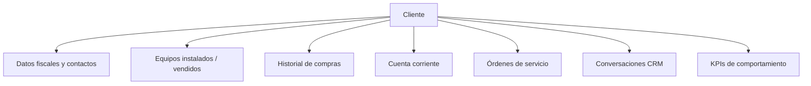
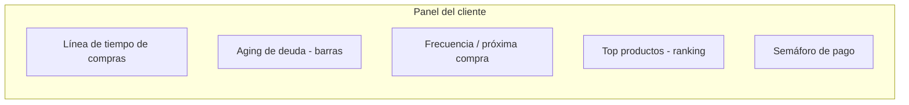
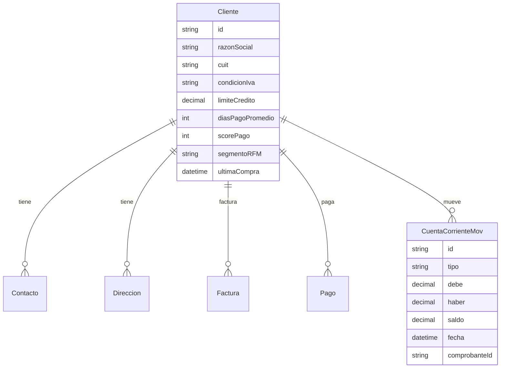

# 03 · Clientes — Comportamiento, Recurrencia y Pagos

Objetivo: que el área de Clientes deje de ser una agenda y pase a ser
**inteligencia comercial**: qué compran, cada cuánto, cómo y cuándo pagan, y
quién es un cliente "bueno".

---

## ✅ Implementado hoy

### Alta de cliente (`/crm/nuevo`)
- Formulario en dos bloques: **datos fiscales/administrativos** y **sucursales de instalación** (mínimo 1).
- Tipo `ORGANISMO_PUBLICO` para Ministerio de Salud, municipalidades, etc.
- Por sucursal: **calle** y **número** separados, ciudad, geocodificación obligatoria vía `/api/geocoding`.
- Mini mapa Leaflet con pin arrastrable (`SucursalMapPreview`).
- API: `POST /api/clientes` con array `sucursales` → `lib/clientes/crear-cliente.ts`.

### Sucursales en ficha (`/crm/[id]`)
- Panel `ClienteSucursalesPanel`: CRUD de sedes post-alta.
- Modelo `ClienteSucursal`: `nombre`, `direccion`, `numero`, `ciudad`, `lat`, `lng`.
- Geocodificación: `lib/geocoding.ts`, `geocodificarSucursalPorId`.

### Carga rápida desde facturación
- `SucursalRapidaModal` en `NuevaFacturaForm`: crear sucursal sin salir de la venta.
- Permiso: `clientes.update` **o** `facturas.create` en `POST /api/clientes/[id]/sucursales`.

### Modelo mental (3 capas)

| Capa | Qué guarda | Para qué |
|------|------------|----------|
| Cliente | CUIT, contacto, sede fiscal | Facturación |
| Sucursal | Dirección geocodificada | Catálogo de sedes |
| Equipo | `sucursalId` | Posición en mapa ST |

---

## 1. Ficha 360° del cliente

La ficha unifica todo lo que hoy está disperso: presupuestos, facturas, OTs,
equipos, mensajes y pagos.

---

## 2. Métricas de comportamiento (lo que pediste)

### 2.1 Qué compran
- **Top productos / categorías** del cliente (ranking por monto y por cantidad).
- **Mix de compra** (ej. 60% insumos, 40% equipos).
- Productos que compra **recurrentemente** (candidatos a reposición proactiva).

### 2.2 Cada cuánto compran (recurrencia)
- **Frecuencia media de compra** (días entre pedidos).
- **Última compra** y **días desde la última compra**.
- **Predicción de próxima compra** (frecuencia media + estacionalidad simple).
- Alerta de **cliente "en riesgo / dormido"** (supera 1.5× su frecuencia normal sin comprar).

### 2.3 Cómo y cuándo pagan (comportamiento de pago)
- **Medio de pago habitual** (transferencia, contado, cheque…).
- **DSO** (Days Sales Outstanding) = promedio de días que tarda en pagar.
- **% pago en término vs. fuera de término.**
- **Saldo actual** y **antigüedad de deuda** (0-30 / 31-60 / 61-90 / +90 días — *aging*).
- **Límite de crédito** y **crédito disponible**.

### 2.4 Valor del cliente
- **LTV** (valor total histórico).
- **Ticket promedio.**
- **RFM score** (Recencia, Frecuencia, Monto) → segmentación A/B/C.
- **Score de pago** (puntaje 0-100 según puntualidad histórica).

---

## 3. Visualizaciones

- **Semáforo de pago**: 🟢 buen pagador / 🟡 demora leve / 🔴 moroso.
- **Timeline** con presupuestos, facturas, pagos y servicios en orden cronológico.
- **Heatmap** de meses con más compra (estacionalidad).
- Listado global de clientes **ordenable/filtrable** por RFM, DSO, saldo, última compra.

---

## 4. Segmentación y acciones

- Segmentos automáticos: **Recurrentes**, **Nuevos**, **En riesgo**, **Morosos**,
  **VIP (top facturación)**.
- Acciones por segmento (se integran con CRM y n8n):
  - "Dormidos" → campaña de re-contacto.
  - "Recurrentes" → recordatorio de reposición.
  - "Morosos" → recordatorio de pago automático.

---

## 5. Modelo de datos (extensión)

- Las métricas pesadas (DSO, RFM, LTV) se calculan en **vistas materializadas /
  jobs nocturnos** y se cachean en el cliente para listar rápido; el detalle se
  recalcula on-demand.
- Multi-dirección y multi-contacto (el presupuesto ya distingue domicilio y
  "dirección de entrega").
