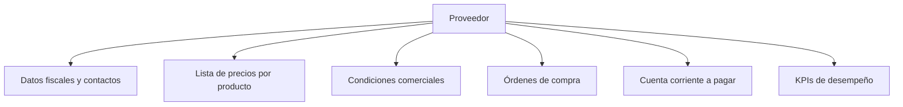
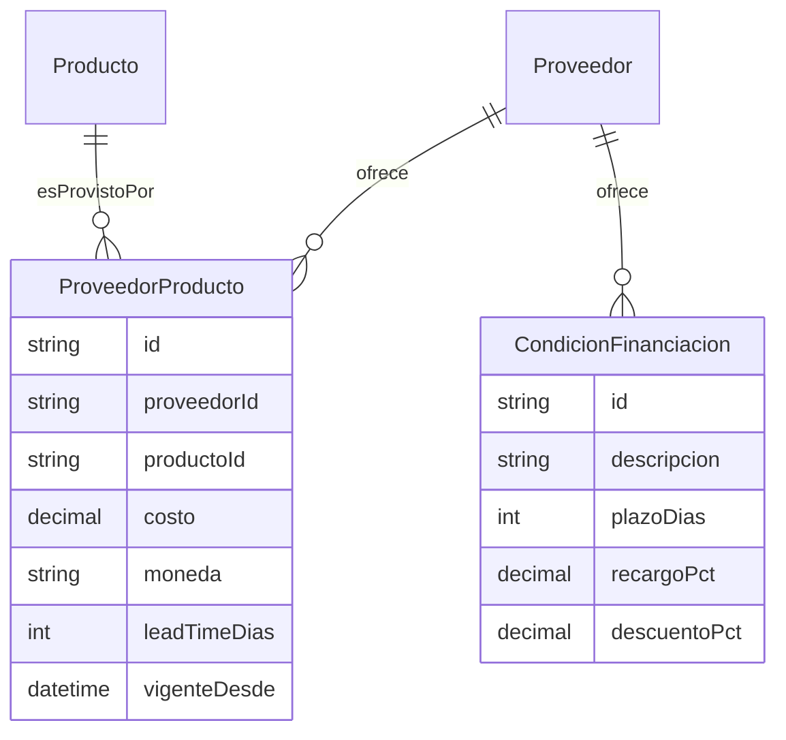

# 04 · Proveedores

Objetivo: cargar **todo lo útil de cada proveedor** — qué precios manejan, qué
financiación/porcentajes dan, condiciones, contactos y desempeño — para comprar
mejor y más barato.

---

## 1. Ficha del proveedor

### 1.1 Datos generales
- Razón social, CUIT, condición IVA, rubro, país/origen (nacional/importado).
- Múltiples **contactos** (comercial, técnico, postventa) con cargo, mail, tel, WhatsApp.
- Múltiples **direcciones** (fiscal, depósito de retiro).
- Marcas / líneas que representa (ej. HAEMONETICS, como en el presupuesto).

### 1.2 Condiciones comerciales (lo que pediste)
- **Financiación**: plazos (contado, 30/60/90 días, cuotas) y **% de recargo o
  descuento** por cada plazo.
- **Descuentos**: por volumen, por pronto pago, comerciales por marca.
- **Moneda** (ARS / USD) y si los precios son **dolarizados** (clave en importados).
- **Lead time** (plazo de entrega) y stock típico.
- **Mínimo de compra** y condiciones de flete.
- **Garantía** que ofrece por producto.

### 1.3 Lista de precios por producto
- Costo unitario por producto/proveedor, **con fecha de vigencia** (histórico de
  precios para ver evolución).
- Moneda y alícuota.
- Permite, ante un faltante, comparar **el mismo producto en varios proveedores**.

---

## 2. Comparador de compra

Al generar una orden de compra o ante un faltante, el sistema muestra:

| Proveedor   | Costo unit. | Moneda | Financiación      | Lead time | Última compra | Mejor opción |
| ----------- | ----------- | ------ | ----------------- | --------- | ------------- | :----------: |
| Proveedor A | $100.000    | ARS    | 30d (+0%)         | 5 días    | hace 2 meses  | ✅           |
| Proveedor B | USD 95      | USD    | 60d (+4%)         | 15 días   | hace 8 meses  |              |

Calcula el **costo financiero real** (precio + recargo por plazo) para sugerir la
mejor opción según el criterio elegido (más barato / más rápido / mejor financiación).

---

## 3. Desempeño del proveedor (KPIs)

- **Cumplimiento de plazos** (entregas a término vs. tarde).
- **Calidad** (% de devoluciones / fallas).
- **Variación de precios** en el tiempo (inflación por proveedor).
- **Volumen comprado** y participación.
- **Cuenta corriente a pagar**: saldo, próximos vencimientos, aging.

---

## 4. Integraciones

- Las **órdenes de compra** (doc 06) se emiten contra un proveedor usando sus
  condiciones y lista de precios.
- La **recepción de mercadería** actualiza stock y la **cuenta corriente a pagar**.
- Trazabilidad: cada equipo en stock sabe **de qué proveedor y qué OC** vino
  (enlaza con el tracking del doc 07).
