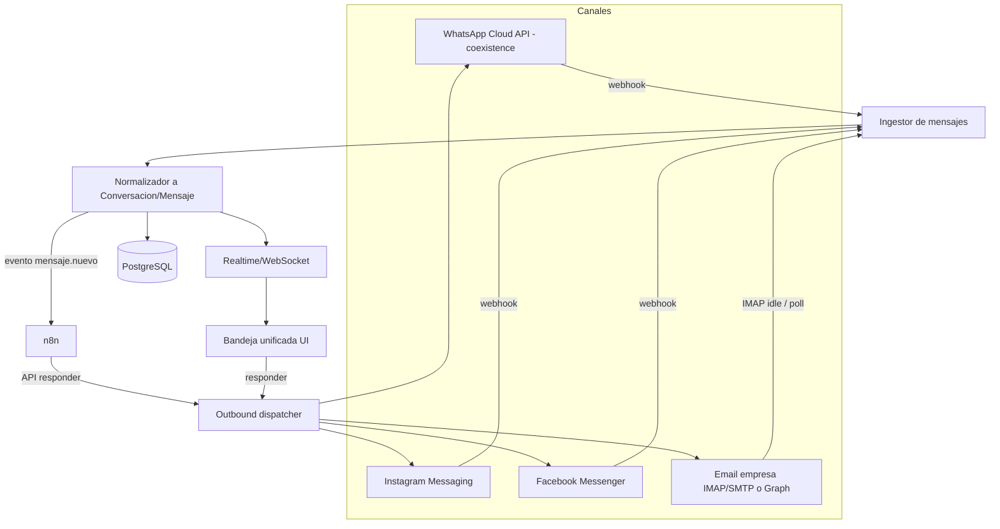
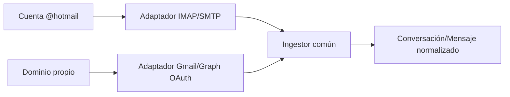
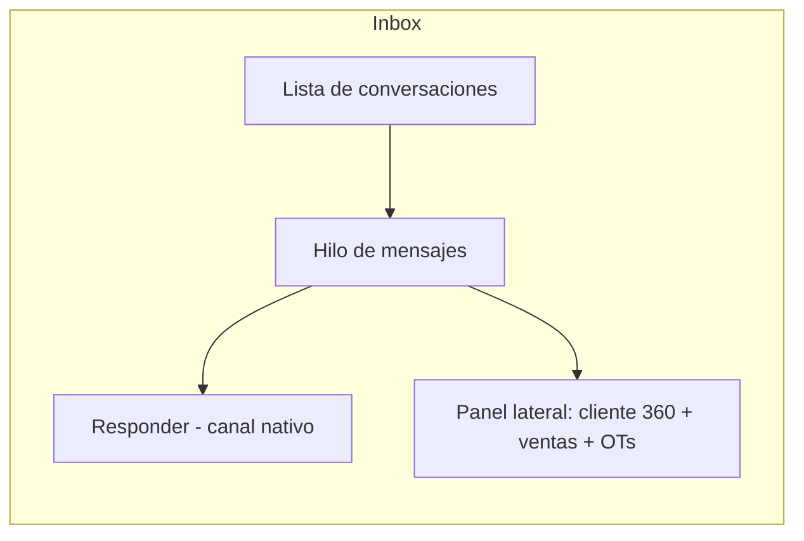
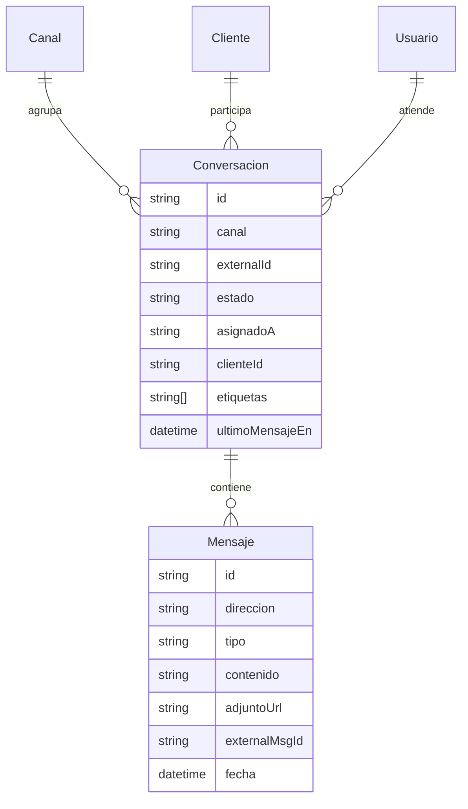

# 05 · CRM Omnicanal

Objetivo: una **bandeja unificada** donde lleguen los mensajes de **correo de la
empresa, WhatsApp (coexistence), Facebook Messenger e Instagram**, para vender y
dar soporte desde un solo lugar, con **n8n conectable**.

---

## ✅ Implementado hoy

### Rutas UI
| Ruta | Componente |
|------|------------|
| `/crm` | Listado clientes + `ClientesTable` |
| `/crm/nuevo` | `NuevoClienteForm` |
| `/crm/[id]` | `ClienteFicha` |
| `/crm/inbox` | `InboxPanel` — bandeja omnicanal |
| `/crm/embudo` | Kanban `EmbudoKanbanApp` |

### Bandeja (`InboxPanel`)
- Lista conversaciones por canal; panel lateral con cliente vinculado.
- Filtros servidor: **canal**, **estado**, **asignado** (`asignadoId`, `sinAsignar=true` en GET `/api/crm/conversaciones`).
- **Adjuntos** en mensajes: upload vía `POST /api/crm/adjuntos`, visualización en hilo.
- **Respuestas rápidas** (snippets): `GET /api/crm/snippets` + picker en caja de respuesta; CRUD con `crm.manage_channels`.
- **Historial del cliente** (`ClienteHistorialInbox`): últimas OTs y productos facturados.
- Clic en OT → `HistorialOTDetalleModal` (`GET /api/ots/[id]`).
- Clic en producto → `HistorialProductoDetalleModal` (`GET /api/facturas/items/[id]/detalle`).
- **Agregar como cliente**: `ClienteProspectoModal` (crear o vincular existente).
- Acciones rápidas: presupuesto, OT, preventivo, ver en mapa (con `clienteId` precargado).

### API historial
- `GET /api/clientes/[id]/historial` — servicios (OTs) + productos (ítems factura).
- Permisos: `crm.read` o `clientes.read`.

### Demo / seed
- Conversación **Lic. Graciela Torres** → **Clínica San Juan**.
- Script idempotente: `scripts/demo-historial-graciela.ts`.

---

## 1. Arquitectura omnicanal

Idea central: **todo mensaje, venga de donde venga, se normaliza** a una
`Conversacion` con `Mensaje`s. La UI y n8n trabajan sobre ese modelo común.

---

## 2. Conectores por canal

### 2.1 WhatsApp (coexistence)
- **Meta WhatsApp Business Platform – Cloud API** en modo **coexistencia**: la
  empresa sigue usando la app de WhatsApp Business en el celular **y** la API al
  mismo tiempo; los chats se sincronizan.
- Requiere: Meta Business verificado, número conectado, **token permanente** y
  **webhook** verificado (`verify token`).
- Soporta plantillas (HSM) para iniciar conversación fuera de la ventana de 24 h.

### 2.2 Instagram y Facebook
- **Meta Graph / Messenger Platform**: se conecta la **Página de Facebook** y la
  cuenta de **Instagram profesional** vinculada.
- Webhooks de `messages`, `messaging_postbacks`, comentarios/DM.
- Permisos: `pages_messaging`, `instagram_manage_messages`.

### 2.3 Correo de la empresa
**Decisión confirmada: se soportan ambos** mediante un adaptador de correo común,
configurable por cuenta en Configuración → Integraciones:
- **IMAP/SMTP** para el `@hotmail.com` actual (u otro buzón): IMAP IDLE/poll para
  entrada, SMTP para salida.
- **API Graph / Gmail (OAuth)** para cuando migren a dominio propio: más robusto,
  hilos nativos, sin contraseñas guardadas.

- Los mails se agrupan por **hilo** y se asocian al cliente por dirección.
- El tipo de cuenta (`IMAP` | `GMAIL` | `GRAPH`) se define por canal; agregar una
  nueva casilla no requiere cambiar código.

> Todas las credenciales/tokens se guardan **cifradas** y se administran en
> Configuración → Integraciones (doc 08), nunca en el repo.

---

## 3. Bandeja unificada (UI)

Funciones:
- Filtros por **canal, estado (abierta/pendiente/cerrada), asignado, etiqueta**.
- **Asignación** a un usuario/equipo (Ventas vs. Servicio Técnico).
- **Etiquetas** (venta, soporte, reclamo, presupuesto).
- **Vincular conversación a Cliente** (si el número/mail no existe, alta rápida →
  se vuelve lead/cliente).
- **Acciones rápidas**: crear presupuesto, crear OT de servicio, agendar
  preventivo, desde el propio chat.
- **Respuestas predefinidas** (snippets) y **SLA de respuesta** (tiempo de
  primera respuesta).
- Adjuntos (imágenes, PDFs) hacia/desde todos los canales.

---

## 4. Modelo de datos (extensión)

- `externalId` / `externalMsgId` garantizan **idempotencia** (no duplicar
  mensajes que Meta reenvía).
- `direccion` = entrante/saliente; `canal` = whatsapp/instagram/facebook/email.

---

## 5. Integración con n8n

Dos sentidos:
- **iBiomédica → n8n**: emite eventos (`conversacion.creada`, `mensaje.nuevo`,
  `cliente.sin_respuesta_2h`) por webhook → n8n arma flujos (auto-respuesta,
  derivación, notificaciones).
- **n8n → iBiomédica**: la API expone endpoints para **responder**, **etiquetar**,
  **crear lead** o **agendar** desde un flujo.

Casos de uso n8n:
- Fuera de horario: respuesta automática + creación de conversación "pendiente".
- Detección de palabra clave "presupuesto" → asigna a Ventas + crea tarea.
- Soporte: "no anda / falla" → crea OT de servicio y avisa a Técnico.

---

## 6. Privacidad y cumplimiento

- Consentimiento y ventana de 24 h de WhatsApp respetadas (uso de plantillas HSM).
- Retención y export de conversaciones por cliente.
- Auditoría de quién respondió qué y cuándo.
