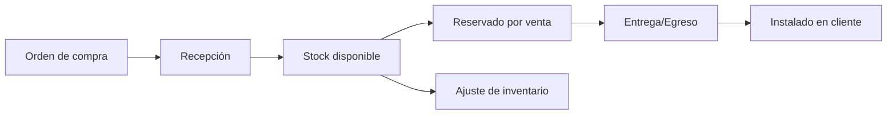
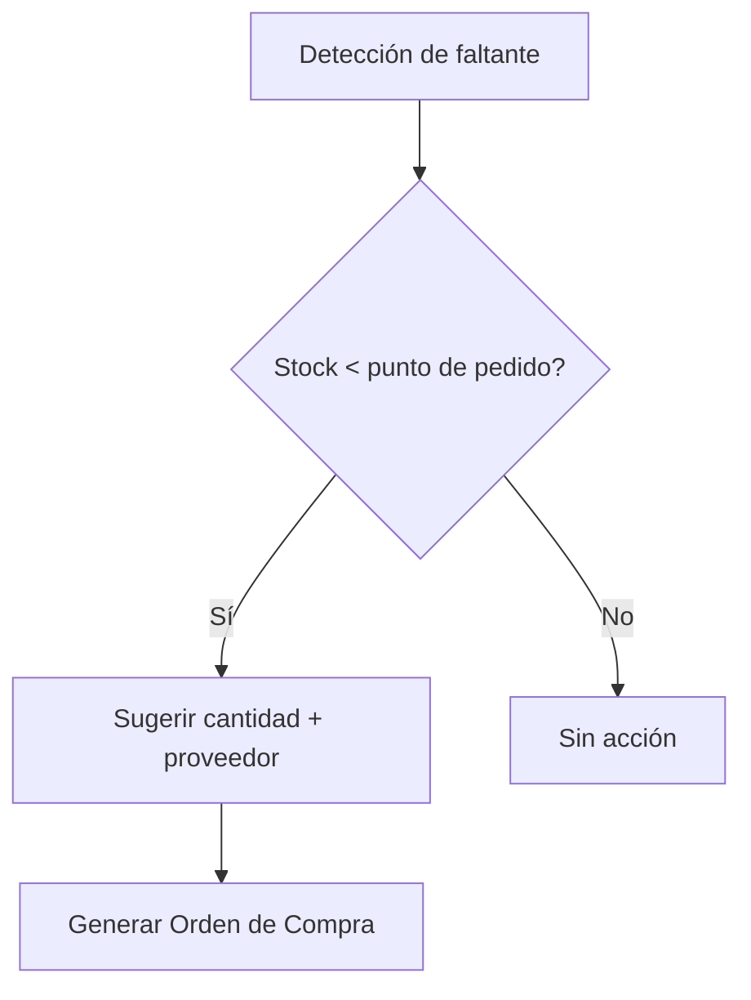
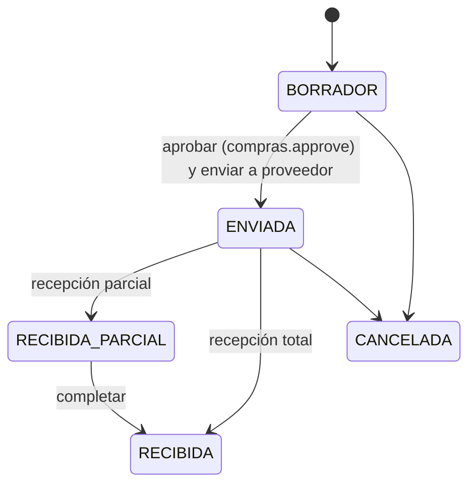
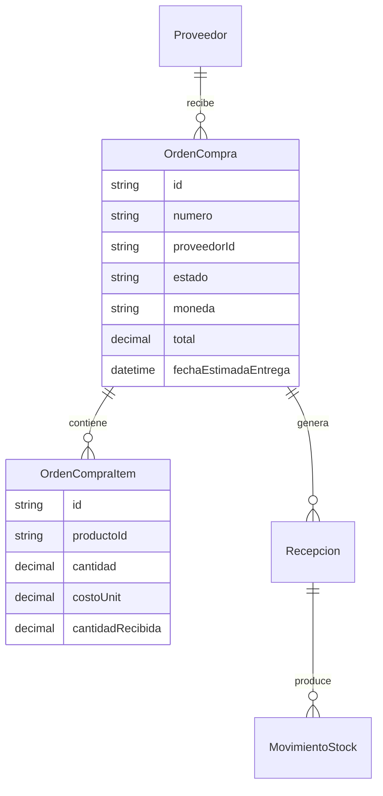
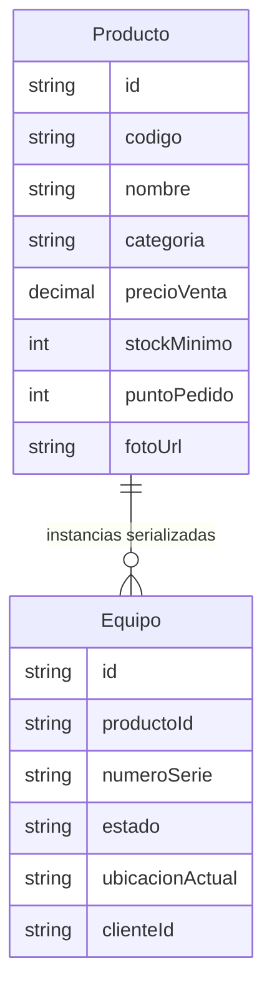

# 06 · Inventario / ERP + Órdenes de Compra

Objetivo: gestión de stock **nivel empresa**, con reposición inteligente,
trazabilidad por número de serie/lote, multi-depósito y **órdenes de compra**
generadas desde faltantes o para productos nuevos.

---

## 1. Conceptos de inventario "de alto nivel"

| Concepto                     | Para qué sirve                                                       |
| ---------------------------- | ------------------------------------------------------------------- |
| **Multi-depósito / ubicación** | Saber stock por local, depósito, vehículo de técnico.             |
| **Stock mínimo / máximo / punto de pedido** | Disparar reposición automática.                  |
| **Lead time del proveedor**  | Calcular *cuándo* pedir, no solo *cuánto*.                          |
| **Stock de seguridad**       | Colchón ante variabilidad de demanda.                               |
| **Lote óptimo de compra (EOQ)** | Cuánto pedir para minimizar costo.                              |
| **Series / lotes / vencimientos** | Trazabilidad unitaria (clave en equipos médicos).             |
| **Rotación (turnover) y ABC** | Identificar productos de alta/baja rotación.                       |
| **Costeo** (promedio ponderado / FIFO) | Valuar el stock correctamente.                          |
| **Reservas**                 | Stock comprometido por presupuestos/ventas pendientes.              |
| **Kardex**                   | Historial de cada movimiento (entrada/salida/ajuste).               |

### Estados y movimientos

---

## 2. Reposición inteligente (lo que pediste)

Pantalla **"Reposición / Faltantes"** que muestra, por producto:

- Stock actual vs. mínimo vs. punto de pedido.
- **Demanda promedio** (consumo últimos N meses).
- **Cobertura en días** (cuánto dura el stock al ritmo actual).
- **Sugerencia de compra** (cantidad recomendada según min/max + EOQ).
- **A quién comprarle** (mejor proveedor del comparador, doc 04).
- **A quién le compré por última vez** (último proveedor, fecha y precio).
- Semáforo: 🔴 quebrado · 🟡 bajo punto de pedido · 🟢 ok.

> "A quién compré por última vez" sale del histórico `ProveedorProducto` +
> recepciones; el comparador propone si conviene mantener o cambiar de proveedor.

---

## 3. Órdenes de Compra (OC)

### 3.1 Origen
- **Desde faltantes**: seleccionar productos bajo punto de pedido → OC
  (agrupando por proveedor automáticamente).
- **Productos nuevos**: OC manual de ítems que aún no están en catálogo (se
  crean al recepcionar).

### 3.2 Flujo y aprobación

- La OC usa **condiciones del proveedor** (precio, financiación, moneda, lead time).
- **Recepción** (parcial o total) suma stock, registra **serie/lote**, costo real
  y actualiza la **cuenta corriente a pagar**.
- La OC se puede **enviar por email/WhatsApp** al proveedor (PDF con la misma
  infraestructura de plantillas).

### 3.3 Modelo

---

## 4. Producto vs. Equipo (importante para trazabilidad)

- **Producto**: el ítem de catálogo (modelo, marca, código tipo `HOE098`).
- **Equipo / unidad serializada**: una unidad física concreta con **número de
  serie**, que se compra, ingresa a stock, se vende y se **instala** en un
  cliente. Esto habilita el tracking de punta a punta (doc 07).

---

## 5. Reportes de inventario

- Valuación de stock (a costo / a venta).
- ABC por rotación y por margen.
- Quiebres de stock e historial de faltantes.
- Productos sin movimiento (obsolescencia).
- Próximas entregas (OCs en tránsito).

---

## 6. Venta de equipos (catálogo → cliente)

Flujo alineado en presupuesto, factura y servicio técnico:

1. **Catálogo** — ítem `tipoArticulo = EQUIPO` con kit (`InventarioKitItem`), serie y preventivo opcionales.
2. **Presupuesto / Factura** — línea con `inventarioId`, `numeroSerie`, `proximoPreventivo`.
3. **Factura (EQUIPO)** — **`sucursalInstalacionId` obligatorio** por línea; carga rápida vía `SucursalRapidaModal` si el cliente no tiene la sede.
4. **Emisión AFIP** — `lib/afip/emitir.ts` llama `provisionarEquiposDesdeFactura`: crea `Equipo`, kit clínico, `PlanMantenimiento`, OT `PREVENTIVO`, egresa stock; asigna `Equipo.sucursalId`.
5. **Homologación** — `POST /api/facturas/[id]/provisionar-equipos` (sin AFIP) reutiliza la misma función.
6. **Mapa** — coordenadas desde sucursal (`lib/equipos/resolver-ubicacion-equipo.ts`).
7. **Import Excel** — columnas `tipo_articulo`, `marca`, `modelo`, etc.; hoja opcional `kit`.

Constantes UI: `lib/inventario-constants.ts`.

---

## 7. Alquiler de equipos (stock serializado)

Estado `InventarioUnidad`: `EN_STOCK` → **`EN_ALQUILER`** (activar contrato) → `EN_STOCK` (devolver).

- No es venta: la unidad sigue siendo propiedad de la empresa.
- Unidades elegibles: `GET /api/alquiler/unidades-disponibles` (estado `EN_STOCK`).
- Devolución: `lib/inventario/unidades.ts` → `devolverUnidadDeAlquiler`.

Doc canónico: [`24-alquiler-equipos.md`](24-alquiler-equipos.md).
