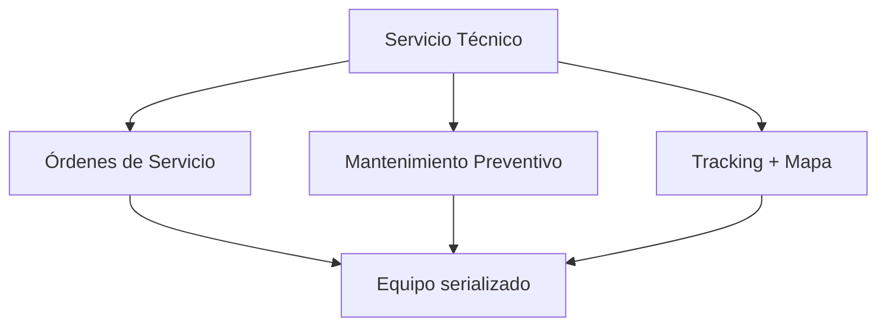
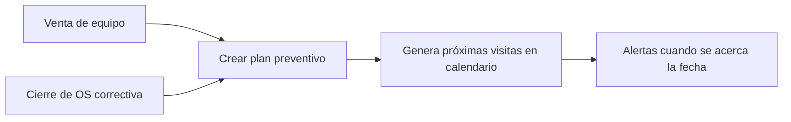
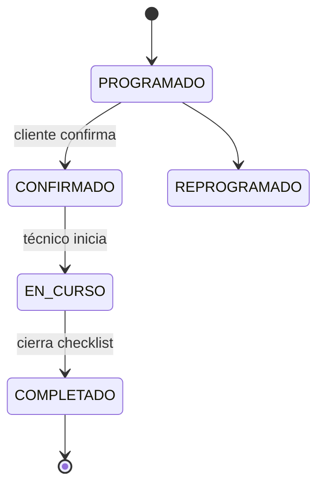
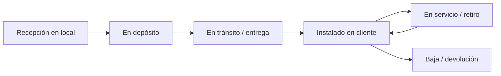
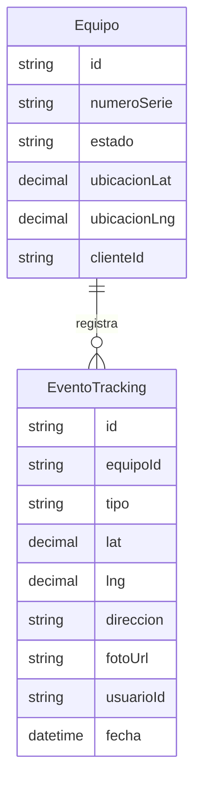
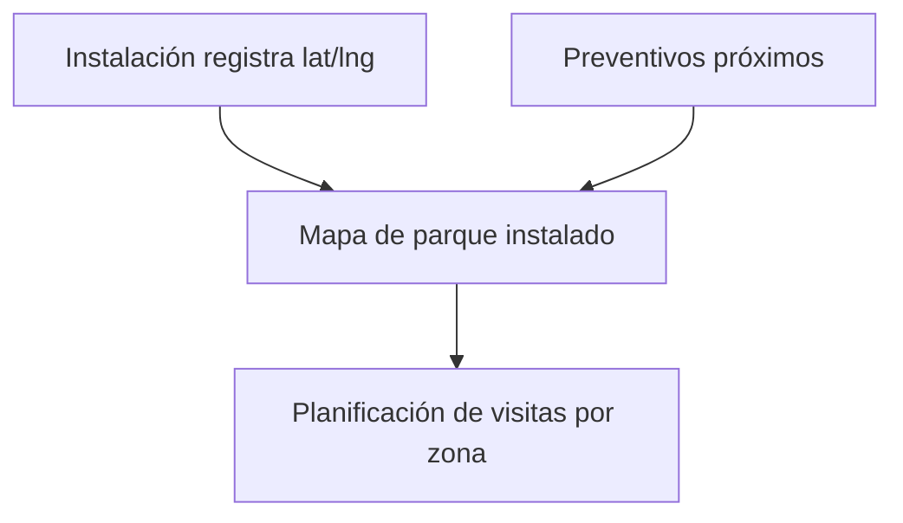

# 07 · Servicio Técnico + Mantenimiento Preventivo + Tracking

Tres grandes capacidades:
1. **Órdenes de Servicio** (correctivo, lo que ya existe, mejorado).
2. **Mantenimiento Preventivo** (rama nueva con calendario y alertas).
3. **Tracking + Mapa**: dónde está cada equipo, de principio a fin.

---

## 1. Órdenes de Servicio (OS)

- Tipos: **correctivo, preventivo, instalación, calibración, garantía**.
- Asignación a técnico (Nicolás/Joaquín/Leonardo), prioridad y **SLA** (ya existe).
- Checklist por tipo de equipo, repuestos usados (descuenta stock), diagnóstico,
  firma del cliente (conformidad), fotos antes/después.
- Genera **remito de servicio** y puede derivar en **factura** o en
  **presupuesto** de reparación.
- Historial completo por equipo (cada OS queda en la hoja de vida del equipo).
- **Historia clínica del equipo** (`/servicio-tecnico/equipos/[id]`): ficha con
  datos técnicos, accesorios, componentes con vencimiento (baterías, filtros),
  bitácora unificada (OT + preventivo + tracking + notas) y planes preventivos.

---

## 2. Mantenimiento Preventivo (rama nueva)

### 2.1 Plan de mantenimiento
Cada equipo vendido/instalado puede tener un **plan**: frecuencia (ej. cada 6
meses / cada N horas de uso), tareas, repuestos previstos y técnico sugerido.

### 2.2 De dónde nace un preventivo (lo que pediste)
Se carga **después de una venta** o **después de un servicio**:

### 2.3 Pantalla "Equipos a mantener"
Tablero que lista **qué equipos ya necesitan preventivo**:
- Equipos **vencidos** (pasó la fecha) 🔴.
- Equipos **próximos** (dentro de X días) 🟡.
- Filtros por cliente, zona, técnico, tipo de equipo.
- Acción directa: **agendar visita** (crea evento en calendario + OS preventiva).

### 2.4 Calendario
- **FullCalendar** con vistas mes/semana/día y por técnico.
- Eventos = visitas de preventivo / instalaciones / correctivos agendados.
- Drag & drop para reprogramar; detecta solapamientos por técnico.
- Recordatorios automáticos (al técnico y al cliente) vía n8n/CRM.

---

## 3. Tracking de equipos + Mapa (punta a punta)

Requisito: saber **exactamente dónde está cada equipo que vendemos**, desde que
llega al local hasta dónde se instaló, **con fecha y hora**, y un **mapa
interactivo**.

### 3.1 Ciclo de vida del equipo (con geolocalización)

Cada transición registra un **evento de tracking** con:
- `estado`, `timestamp` (fecha y hora exactas), `usuario` que lo registró,
- **lat/lng** + dirección (geocodificada), opcionalmente foto y nota.

### 3.2 Modelo

### 3.3 Mapa interactivo (implementado)

- **Leaflet** en `/servicio-tecnico/mapa` (`GET /api/tracking/mapa`).
- Pins de equipos instalados según sucursal geocodificada.

### Ubicación del equipo vía sucursal

Prioridad en `lib/equipos/resolver-ubicacion-equipo.ts`:

1. Coordenadas del equipo (`lat`/`lng` o dirección geocodificada).
2. **Sucursal** (`Equipo.sucursalId` → `ClienteSucursal.lat/lng`).
3. Sede fiscal del cliente.

Flujo: factura con `ItemFactura.sucursalInstalacionId` → `provisionarEquiposDesdeFactura` asigna `Equipo.sucursalId` → aparece en el mapa.

Geocodificación de sucursales: `lib/geocoding.ts` (Nominatim), validación en alta de cliente y `SucursalRapidaModal`.

### 3.4 Mapa interactivo (diseño / roadmap)
- **Leaflet + react-leaflet** (OpenStreetMap) — sin costo de licencia.
- Vista 1: **mapa de equipos instalados** (pins por cliente/equipo, filtros por
  estado, tipo, técnico, "a mantener pronto").
- Vista 2: **recorrido de un equipo** (su línea de tiempo geográfica desde el
  local hasta la instalación).
- Geocoding de direcciones (Nominatim) y opción de fijar el pin manualmente.
- En equipos médicos, esto sirve también para **planificar rutas de preventivo**
  (agrupar visitas por zona).

---

## 4. Integraciones del módulo
- **Inventario**: el equipo serializado es la misma entidad (doc 06); el tracking
  continúa el ciclo que empezó en la recepción de la OC.
- **Clientes**: las OS y preventivos aparecen en la ficha 360 del cliente.
- **CRM**: un mensaje de soporte puede crear una OS directamente.
- **Facturación**: una OS puede facturarse o presupuestarse.
- **n8n**: recordatorios de preventivo, encuestas de satisfacción post-servicio.
