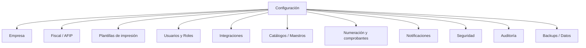

# 08 · Configuración

Centro de control del sistema. Acceso restringido (`config.*`, principalmente
SUPERADMIN; GERENTE en solo lectura).

---

## 1. Empresa
- Razón social, nombre de fantasía, **logo**, CUIT, IIBB, inicio de actividades,
  condición IVA, domicilios, teléfonos, mails, redes.
- Moneda base, zona horaria (America/Argentina/Cordoba), formato de fecha/número.

## 2. Emisores / Fiscal / AFIP (multi-CUIT, carga manual)
- **ABM de Emisores**: alta manual de uno o más emisores (razón social, CUIT,
  condición IVA, IIBB, inicio de actividades, domicilio, contacto). Uno marcado
  como **predeterminado**.
- Por emisor: certificado (.crt) y clave (.key) **cifrados**, alias, ambiente
  (homologación/producción) y **puntos de venta** electrónicos.
- Tipos de comprobante habilitados y alícuotas de IVA.
- Test de conexión a WSAA/WSFE y estado del servicio por emisor.
- Integración Padrón (autocompletar clientes por CUIT).
- Al emitir un comprobante se **elige el emisor**; la numeración y el CAE quedan
  ligados a ese emisor + punto de venta.

## 3. Plantillas de impresión
- Editor visual de plantillas (factura, presupuesto, remito, OC, OS) — ver doc 02.
- Versionado, duplicar, marcar predeterminada por tipo.
- Vista previa con datos de ejemplo.

## 4. Usuarios y Roles
- ABM de usuarios (solo SUPERADMIN/GERENTE), asignación de **múltiples roles**.
- ABM de **roles** y edición de la **matriz de permisos** (doc 01).
- Invitaciones por email, reseteo de contraseña, activar/desactivar.

## 5. Integraciones
- **CRM**: WhatsApp Cloud API, Instagram, Facebook, correo (IMAP/SMTP o Graph) —
  tokens, webhooks, números/páginas conectadas (doc 05).
- **n8n**: URL base, API key, catálogo de eventos/webhooks salientes y entrantes.
- **Storage** (S3/MinIO), **mapas** (Leaflet/OSM en sucursales y tracking; Nominatim vía `/api/geocoding` sin API key).
- Estado de salud de cada integración + logs.

## 6. Catálogos / Maestros
- Categorías de productos, marcas, depósitos/ubicaciones, unidades de medida.
- Tipos de cliente (incl. `ORGANISMO_PUBLICO`), condiciones de pago, medios de pago, motivos de ajuste.
- Tareas/checklists de mantenimiento por tipo de equipo.

## 7. Numeración y comprobantes
- Series y numeración de presupuestos, OC, OS, recibos (las facturas las numera AFIP).
- Términos por defecto: vigencia de presupuesto, garantía, plazos.

## 8. Notificaciones
- Plantillas de email/WhatsApp (recordatorio de pago, preventivo, OC al proveedor).
- Reglas: a quién avisar y cuándo (eventos → destinatarios).

## 9. Seguridad
- Política de contraseñas, 2FA (TOTP), expiración de sesión, IPs permitidas.
- Gestión de sesiones activas y cierre remoto.

## 10. Auditoría
- Visor de `AuditLog` (quién, qué, cuándo, antes/después), filtros y export.

## 11. Backups / Datos
- Programación de backups de BD, export de datos (clientes, productos, comprobantes),
  e importación inicial (migración desde el sistema actual).
