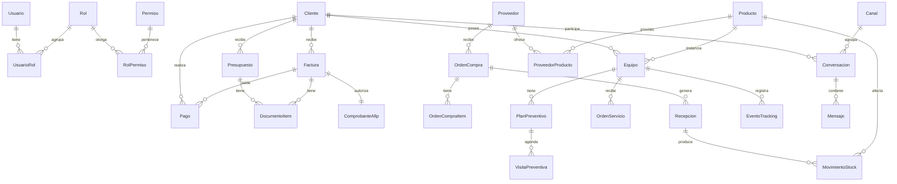

# 09 · Modelo de Datos Consolidado

Diagrama de alto nivel de cómo se relacionan los módulos y un **borrador de schema
Prisma** (propuesta, no final). Lo de hoy (Usuario, Cliente, Equipo,
OrdenTrabajo, Factura, Inventario) se conserva y se extiende.

> **Fuente de verdad en código:** `prisma/schema.prisma`. Este documento mezcla diseño histórico con entidades ya implementadas.

---

## ✅ Implementado en schema (extracto)

### ClienteSucursal (`clientes_sucursales`)

Sedes de instalación geocodificadas, distintas de la dirección fiscal del cliente.

| Campo | Tipo | Notas |
|-------|------|-------|
| `id` | cuid | PK |
| `clienteId` | FK → Cliente | Cascade delete |
| `nombre` | string | Ej. Hospital Las Lomitas |
| `direccion` | string? | Calle |
| `numero` | string? | Altura |
| `ciudad` | string? | |
| `lat`, `lng` | float? | Validados en mapa (Nominatim) |
| `activo` | bool | Soft delete |

Relaciones: `Equipo.sucursalId`, `ItemFactura.sucursalInstalacionId`.

### SystemLog (`system_logs`)

Errores técnicos del sistema (no confundir con `AuditLog`).

| Campo | Tipo | Notas |
|-------|------|-------|
| `id` | cuid | PK |
| `nivel` | enum `NivelLog` | ERROR, WARN, INFO |
| `origen` | string | `api`, `worker-afip`, `worker-crm`, … |
| `ruta`, `metodo` | string? | Endpoint HTTP |
| `mensaje` | string | Hasta 4000 chars |
| `stack` | string? | Stack trace |
| `usuarioId` | string? | Usuario en sesión si aplica |
| `ip` | string? | |
| `metadata` | Json? | Contexto extra |
| `fecha` | DateTime | Retención 15 días |

Helper: `lib/error-log.ts`. Ver [`17-OBSERVABILIDAD-Y-LOGS.md`](17-OBSERVABILIDAD-Y-LOGS.md).

### TipoCliente

Valores: `HOSPITAL`, `CLINICA`, `CONSULTORIO`, `SANATORIO`, `ORGANISMO_PUBLICO`, `OTRO`.

### NegocioEmbudo

Kanban CRM (`/crm/embudo`): etapas, cliente/inventario/usuario en campos dinámicos.

---

## 1. Mapa relacional global



---

## 2. Borrador de schema Prisma (propuesta)

```prisma
// ===== RBAC =====
model Usuario {
  id           String   @id @default(cuid())
  nombre       String
  email        String   @unique
  passwordHash String
  telefono     String?
  avatarUrl    String?
  activo       Boolean  @default(true)
  ultimoAcceso DateTime?
  twoFactor    Boolean  @default(false)
  roles        UsuarioRol[]
  creadoEn     DateTime @default(now())
}

model Rol {
  id        String       @id @default(cuid())
  clave     String       @unique   // SUPERADMIN, GERENTE, VENTAS, ...
  nombre    String
  sistema   Boolean      @default(false)
  usuarios  UsuarioRol[]
  permisos  RolPermiso[]
}

model Permiso {
  id          String       @id @default(cuid())
  clave       String       @unique // "facturas.emit_afip"
  modulo      String
  descripcion String
  roles       RolPermiso[]
}

model UsuarioRol {
  usuarioId String
  rolId     String
  usuario   Usuario @relation(fields: [usuarioId], references: [id])
  rol       Rol     @relation(fields: [rolId], references: [id])
  @@id([usuarioId, rolId])
}

model RolPermiso {
  rolId     String
  permisoId String
  rol       Rol     @relation(fields: [rolId], references: [id])
  permiso   Permiso @relation(fields: [permisoId], references: [id])
  @@id([rolId, permisoId])
}

// ===== COMERCIAL =====
model Cliente {
  id             String   @id @default(cuid())
  razonSocial    String
  tipo           TipoCliente
  cuit           String?
  condicionIva   String?
  limiteCredito  Decimal? @db.Decimal(14,2)
  diasPagoProm   Int?
  scorePago      Int?
  segmentoRFM    String?
  ultimaCompra   DateTime?
  activo         Boolean  @default(true)
  contactos      Contacto[]
  direcciones    Direccion[]
  presupuestos   Presupuesto[]
  facturas       Factura[]
  pagos          Pago[]
  ctaCte         CuentaCorrienteMov[]
  equipos        Equipo[]
  conversaciones Conversacion[]
  creadoEn       DateTime @default(now())
}

model Documento {        // base lógica; en Prisma se modela como Presupuesto/Factura
  id          String   @id @default(cuid())
}

model Presupuesto {
  id            String   @id @default(cuid())
  numero        String   @unique
  clienteId     String
  vendedorId    String?
  estado        EstadoPresupuesto @default(BORRADOR)
  vigenciaDias  Int      @default(5)
  subtotal      Decimal  @db.Decimal(14,2)
  bonificacion  Decimal  @db.Decimal(14,2) @default(0)
  total         Decimal  @db.Decimal(14,2)
  observaciones String?
  plantillaId   String?
  items         DocumentoItem[]
  cliente       Cliente  @relation(fields: [clienteId], references: [id])
  creadoEn      DateTime @default(now())
}

model Factura {
  id             String   @id @default(cuid())
  numero         String   @unique
  tipo           TipoFactura
  estado         EstadoFactura @default(BORRADOR)
  clienteId      String
  vendedorId     String?
  presupuestoId  String?
  puntoVenta     Int
  subtotal       Decimal  @db.Decimal(14,2)
  iva            Decimal  @db.Decimal(14,2)
  total          Decimal  @db.Decimal(14,2)
  plantillaId    String?
  afip           ComprobanteAfip?
  items          DocumentoItem[]
  pagos          Pago[]
  cliente        Cliente  @relation(fields: [clienteId], references: [id])
  creadoEn       DateTime @default(now())
}

model ComprobanteAfip {
  id           String   @id @default(cuid())
  facturaId    String   @unique
  cae          String
  caeVto       DateTime
  nroAfip      Int
  qrData       String
  resultado    String   // A=aprobado, R=rechazado
  observaciones String?
  factura      Factura  @relation(fields: [facturaId], references: [id])
}

model DocumentoItem {
  id            String  @id @default(cuid())
  presupuestoId String?
  facturaId     String?
  productoId    String?
  codigo        String?
  descripcion   String
  cantidad      Decimal @db.Decimal(12,2)
  precioUnit    Decimal @db.Decimal(14,2)
  bonificacion  Decimal @db.Decimal(5,2) @default(0)
  subtotal      Decimal @db.Decimal(14,2)
  fotoUrl       String?            // foto opcional por línea
}

model Pago {
  id          String   @id @default(cuid())
  clienteId   String
  facturaId   String?
  medio       String   // TRANSFERENCIA, CONTADO, CHEQUE...
  monto       Decimal  @db.Decimal(14,2)
  fecha       DateTime @default(now())
}

model CuentaCorrienteMov {
  id            String   @id @default(cuid())
  clienteId     String
  tipo          String   // FACTURA / PAGO / NC / ND / AJUSTE
  debe          Decimal  @db.Decimal(14,2) @default(0)
  haber         Decimal  @db.Decimal(14,2) @default(0)
  saldo         Decimal  @db.Decimal(14,2)
  comprobanteId String?
  fecha         DateTime @default(now())
}

// ===== PLANTILLAS =====
model PlantillaImpresion {
  id          String   @id @default(cuid())
  nombre      String
  tipo        String   // FACTURA, PRESUPUESTO, REMITO, OC, OS
  config      Json     // esquema descrito en doc 02
  version     Int      @default(1)
  predeterminada Boolean @default(false)
  creadoEn    DateTime @default(now())
}

// ===== PROVEEDORES / COMPRAS / STOCK =====
model Proveedor {
  id            String   @id @default(cuid())
  razonSocial   String
  cuit          String?
  condicionIva  String?
  moneda        String   @default("ARS")
  marcas        String[]
  productos     ProveedorProducto[]
  condiciones   CondicionFinanciacion[]
  ordenes       OrdenCompra[]
  contactos     Contacto[]
  activo        Boolean  @default(true)
}

model ProveedorProducto {
  id           String   @id @default(cuid())
  proveedorId  String
  productoId   String
  costo        Decimal  @db.Decimal(14,2)
  moneda       String   @default("ARS")
  leadTimeDias Int?
  vigenteDesde DateTime @default(now())
}

model CondicionFinanciacion {
  id          String  @id @default(cuid())
  proveedorId String
  descripcion String
  plazoDias   Int
  recargoPct  Decimal @db.Decimal(5,2) @default(0)
  descuentoPct Decimal @db.Decimal(5,2) @default(0)
}

model Producto {
  id          String  @id @default(cuid())
  codigo      String  @unique
  nombre      String
  categoria   String?
  marca       String?
  precioVenta Decimal? @db.Decimal(14,2)
  stockMinimo Int     @default(0)
  puntoPedido Int     @default(0)
  fotoUrl     String?
  equipos     Equipo[]
  movimientos MovimientoStock[]
}

model OrdenCompra {
  id            String   @id @default(cuid())
  numero        String   @unique
  proveedorId   String
  estado        EstadoOC @default(BORRADOR)
  moneda        String   @default("ARS")
  total         Decimal  @db.Decimal(14,2)
  fechaEstimada DateTime?
  items         OrdenCompraItem[]
  recepciones   Recepcion[]
  creadoEn      DateTime @default(now())
}

model OrdenCompraItem {
  id               String  @id @default(cuid())
  ordenCompraId    String
  productoId       String?
  descripcion      String
  cantidad         Decimal @db.Decimal(12,2)
  costoUnit        Decimal @db.Decimal(14,2)
  cantidadRecibida Decimal @db.Decimal(12,2) @default(0)
}

model Recepcion {
  id            String   @id @default(cuid())
  ordenCompraId String
  fecha         DateTime @default(now())
  movimientos   MovimientoStock[]
}

model MovimientoStock {
  id          String   @id @default(cuid())
  productoId  String
  recepcionId String?
  tipo        String   // ENTRADA / SALIDA / AJUSTE / RESERVA
  cantidad    Decimal  @db.Decimal(12,2)
  deposito    String?
  costoUnit   Decimal? @db.Decimal(14,2)
  fecha       DateTime @default(now())
}

// ===== EQUIPOS / SERVICIO / PREVENTIVO / TRACKING =====
model Equipo {
  id            String   @id @default(cuid())
  productoId    String?
  numeroSerie   String?  @unique
  estado        EstadoEquipo @default(ACTIVO)
  clienteId     String?
  ubicacionLat  Decimal? @db.Decimal(10,7)
  ubicacionLng  Decimal? @db.Decimal(10,7)
  ordenes       OrdenServicio[]
  planes        PlanPreventivo[]
  tracking      EventoTracking[]
}

model OrdenServicio {
  id          String   @id @default(cuid())
  numero      String   @unique
  equipoId    String?
  clienteId   String
  tipo        String   // CORRECTIVO/PREVENTIVO/INSTALACION/CALIBRACION/GARANTIA
  estado      EstadoOT @default(ABIERTA)
  prioridad   Prioridad @default(NORMAL)
  tecnicoId   String?
  slaVence    DateTime
  creadoEn    DateTime @default(now())
}

model PlanPreventivo {
  id            String   @id @default(cuid())
  equipoId      String
  frecuenciaDias Int
  proximaFecha  DateTime
  tareas        Json
  activo        Boolean  @default(true)
  visitas       VisitaPreventiva[]
}

model VisitaPreventiva {
  id            String   @id @default(cuid())
  planId        String
  fecha         DateTime
  estado        String   // PROGRAMADO/CONFIRMADO/EN_CURSO/COMPLETADO/REPROGRAMADO
  tecnicoId     String?
  ordenServicioId String?
}

model EventoTracking {
  id         String   @id @default(cuid())
  equipoId   String
  tipo       String   // RECEPCION/DEPOSITO/TRANSITO/INSTALADO/RETIRO/BAJA
  lat        Decimal? @db.Decimal(10,7)
  lng        Decimal? @db.Decimal(10,7)
  direccion  String?
  fotoUrl    String?
  usuarioId  String?
  fecha      DateTime @default(now())
}

// ===== CRM =====
model Canal {
  id            String   @id @default(cuid())
  tipo          String   // whatsapp/instagram/facebook/email
  nombre        String
  config        Json     // tokens cifrados / referencias
  activo        Boolean  @default(true)
  conversaciones Conversacion[]
}

model Conversacion {
  id             String   @id @default(cuid())
  canalId        String
  externalId     String
  clienteId      String?
  asignadoA      String?
  estado         String   @default("ABIERTA")
  etiquetas      String[]
  ultimoMensajeEn DateTime?
  mensajes       Mensaje[]
  @@unique([canalId, externalId])
}

model Mensaje {
  id             String   @id @default(cuid())
  conversacionId String
  direccion      String   // ENTRANTE/SALIENTE
  tipo           String   // TEXTO/IMAGEN/ARCHIVO/AUDIO
  contenido      String?
  adjuntoUrl     String?
  externalMsgId  String?  @unique
  fecha          DateTime @default(now())
}

// ===== AUDITORÍA =====
model AuditLog {
  id        String   @id @default(cuid())
  usuarioId String?
  accion    String   // "factura.emit", "usuario.create"...
  entidad   String
  entidadId String?
  antes     Json?
  despues   Json?
  ip        String?
  fecha     DateTime @default(now())
}
```

> Es un **borrador** para dimensionar el alcance; al implementar se ajustan
> índices, relaciones inversas y enums. Conviene migrar por fases (doc 10) para
> no romper lo existente.
