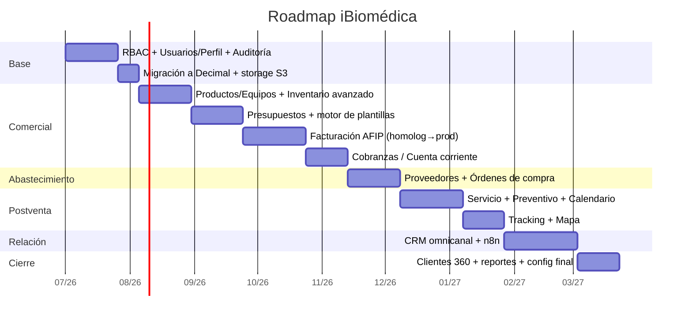
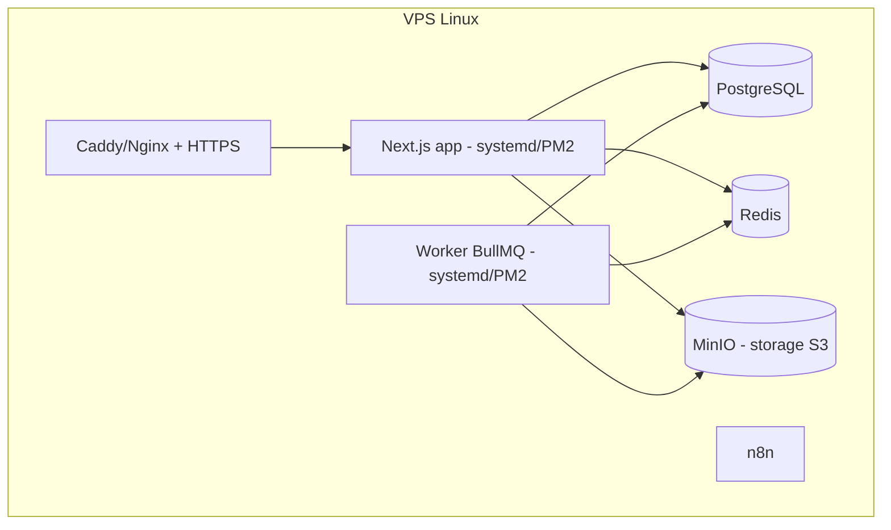

# 10 · Roadmap por Fases

Orden propuesto para construir sin romper lo existente y entregando valor pronto.
Cada fase es entregable y testeable por separado.

---

## Fase 1 — Fundaciones (Core)
- RBAC con tablas (Rol/Permiso/UsuarioRol/RolPermiso) y migración del enum actual. ✅
- ABM de usuarios (alta solo SUPERADMIN/GERENTE) + edición de perfil propio. ✅ (2FA pendiente)
- Auditoría (`AuditLog` + helper `registrarAuditoria`). ✅
- Migrar dinero `Float → Decimal`. ✅ (migración `dinero_decimal` + `lib/serialize.ts`)
- Configurar storage S3/MinIO. ✅ (MinIO + Redis en compose, `lib/storage.ts` con driver local/S3)
- **Por qué primero:** todo lo demás depende de permisos, dinero correcto y archivos.

> **Estado:** Fase 1 implementada. `tsc` en verde; importes ahora en `Decimal(14,2)`
> y serializados a `number` en el borde (RSC/JSON). Storage con seam `local`→`s3`
> listo para enchufar el SDK en Fase 3/4. El worker de colas (BullMQ/Redis) se
> implementa en Fase 4.

## Fase 2 — Inventario y catálogo serializado
- Separar `Producto` (catálogo) de `Equipo` (unidad con serie).
- Multi-depósito, kardex (`MovimientoStock`), min/máx/punto de pedido, ABC, reservas.

## Fase 3 — Presupuestos + motor de plantillas
- `DocumentoItem` con foto opcional y descripción larga configurable.
- `PlantillaImpresion` (JSON) + editor visual + render `@react-pdf`.
- Reproduce el presupuesto actual de la empresa como plantilla por defecto.

## Fase 4 — Facturación electrónica AFIP
- Integración WSAA/WSFEv1 (`@afipsdk/afip.js`), CAE, QR, numeración por AFIP.
- Estados, reintentos por cola, contingencia, notas de crédito/débito.
- Primero **homologación**, luego producción con el contador.

## Fase 5 — Cobranzas / Cuenta corriente
- Pagos, recibos, imputación, aging, límite de crédito (alimenta Clientes 360).

## Fase 6 — Proveedores + Órdenes de compra
- Ficha de proveedor, listas de precio, financiación, comparador.
- OC desde faltantes / productos nuevos, recepción → stock + cta. cte. a pagar.

## Fase 7 — Servicio técnico + preventivo
- OS por tipo, checklists, repuestos, conformidad.
- Planes preventivos (nacen de venta o cierre de OS), calendario FullCalendar,
  pantalla "equipos a mantener".

## Fase 8 — Tracking + mapa ✅ (parcial)
- `EventoTracking` con lat/lng + fecha/hora; mapa Leaflet del parque instalado (`/servicio-tecnico/mapa`).
- **Sucursales geocodificadas** (`ClienteSucursal`) alimentan posición de equipos vía `Equipo.sucursalId`.
- Pendiente: recorrido por equipo, planificación de rutas por zona.

## Fase 9 — CRM omnicanal + n8n ✅ (parcial)
- Bandeja unificada, asignación, etiquetas, vincular cliente.
- **Historial del cliente** en bandeja (OTs + productos facturados + modales detalle).
- **Embudo Kanban** (`/crm/embudo`).
- Alta cliente `/crm/nuevo` con sucursales + validación mapa.
- Pendiente: conectores productivos WhatsApp/Meta, workers email en prod.

## Fase 10 — Inteligencia de clientes y cierre
- Clientes 360 con RFM/DSO/LTV, segmentación y acciones (métricas parciales en `/api/clientes/[id]/metricas`).
- Reportes (fiscales, comercial, inventario), Configuración final, pulido.

---

## Decisiones — confirmadas ✅

1. **AFIP** → ✅ **`@afipsdk/afip.js`** propio (self-host con certificado propio).
2. **Correo del CRM** → ✅ **Ambos**: IMAP/SMTP (`@hotmail.com`) **y** dominio
   propio (Gmail/Microsoft Graph). El canal de correo es configurable por cuenta.
3. **Mapas** → Leaflet + OSM (recomendado del experto).
4. **WhatsApp** → Cloud API en coexistence (a confirmar Meta Business al llegar a Fase 9).
5. **Hosting** → ✅ **VPS** (Linux). Backups, storage y worker definidos abajo.
6. **Multi-CUIT** → ✅ **Carga manual de emisores**: modelo `Emisor` con N CUIT /
   razones sociales / puntos de venta; se elige el emisor al facturar.

## Infraestructura en VPS

- **Backups**: `pg_dump` diario + retención (cron) a almacenamiento externo;
  snapshot del bucket MinIO; backup de certificados AFIP cifrados.
- **Storage**: MinIO (S3-compatible) self-host en el VPS para fotos, PDFs y
  certificados.
- **Worker de colas**: proceso aparte (BullMQ + Redis) para AFIP, mail, recordatorios.
- **Reverse proxy**: Caddy o Nginx con TLS automático; firewall y fail2ban.
- Procesos gestionados con **PM2** o **systemd**; despliegue por `git pull` + build.
