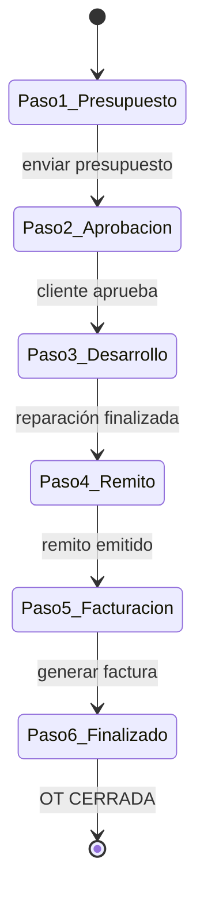
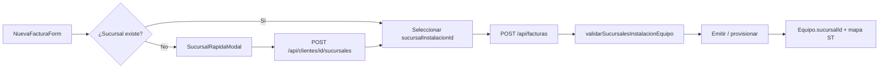
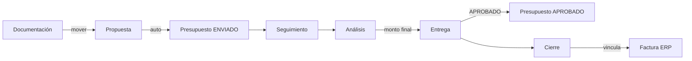

# 13 — Flujos comerciales (OT, presupuesto, factura)

## 1. Flujo OT → comercial (6 pasos UI)

Componente: `components/servicio-tecnico/OTFlujoComercial.tsx`  
Página: `/servicio-tecnico/[id]`



| Paso | Acción usuario | API / ruta | Efecto |
|------|----------------|------------|--------|
| 1 | Crear presupuesto | `POST /api/presupuestos` `{ otId }` | `Presupuesto.otId` FK; vigencia 1–10 días y garantía 1–12 meses (editable antes del remito) |
| 1 | Enviar | PATCH presupuesto → ENVIADO | — |
| 2 | Aprobar | PATCH → APROBADO | Habilita paso 3 |
| 3 | Iniciar / finalizar reparación | PATCH `/api/ots/[id]` estado `EN_PROCESO` / `CERRADA` | — |
| 4 | Generar remito | `POST /api/presupuestos/[id]/remito` | Crea `OrdenVenta` + `RemitoVenta` en borrador |
| 4 | Asignar series | PATCH `/api/remitos-venta/[id]/items/[itemId]` | Vincula unidades/equipos por línea |
| 4 | Emitir remito | `POST /api/remitos-venta/[id]/emitir` | Remito `EMITIDO`; reserva stock |
| 5 | Generar factura | `/facturacion/nueva?remitoId=&otId=&presupuestoId=` | Ítems y series desde remito emitido |
| 6 | Finalizar | PATCH OT → `CERRADA` | Cierra ciclo; garantía propagada al equipo |

### Reglas

- Presupuesto desde OT precarga ítems/repuestos (`presupuestos/nuevo?otId=`).
- Repuestos OT persisten vía PATCH `/api/ots/[id]` campo `repuestos`.
- **No se factura directo desde presupuesto OT:** requiere remito emitido (`lib/facturas/validar-flujo-remito.ts`).
- Vigencia/garantía del presupuesto OT se pueden editar en detalle hasta generar el remito.
- Al facturar, la garantía se aplica al equipo (`lib/garantia.ts`): meses, “Sin garantía” (limpia fecha) o nota “Según fabricante”.
- El botón “Emitir remito” en el wizard solo se habilita cuando todas las series obligatorias están asignadas.

## 2. Presupuesto standalone (sin OT)

Flujo comercial estándar con remito cuando hay ítems de inventario serializados:

| Estado | Transiciones |
|--------|--------------|
| BORRADOR | → ENVIADO |
| ENVIADO | → APROBADO / RECHAZADO / VENCIDO |
| APROBADO | → remito → factura → CONVERTIDO |

- Presupuestos **sin** `OrdenVenta` pueden facturarse directo (servicios / legacy).
- Si ya existe `OrdenVenta` o remito, la factura debe crearse desde el remito emitido.

API: `app/api/presupuestos/[id]/route.ts`, `remito/route.ts`, `convertir/route.ts`.

## 3. Facturación

| Estado Factura | Significado |
|--------------|-------------|
| BORRADOR | Editable |
| PENDIENTE_CAE | En cola AFIP |
| EMITIDA | CAE OK |
| RECHAZADA | AFIP rechazó |
| ANULADA | Nota crédito / baja |

Emisión: `POST /api/facturas/[id]/emitir` → worker AFIP (BullMQ).

PDF: plantilla predeterminada tipo FACTURA + `build-datos.ts`.

## 4. Modelo relacional (extracto)

```
OrdenTrabajo 1 ── * Presupuesto (otId)
Presupuesto 1 ── 0..1 OrdenVenta
OrdenVenta 1 ── * RemitoVenta
RemitoVenta 1 ── 0..1 Factura
Presupuesto 1 ── 0..1 Factura (vía remito o legacy sin OV)
Cliente 1 ── * OT, Presupuesto, Factura
Equipo 1 ── * OT, HistoriaClinicaEntrada
```

Ver `prisma/schema.prisma`: `OrdenTrabajo`, `Presupuesto`, `OrdenVenta`, `RemitoVenta`, `ItemRemito`, `Factura`, `RepuestoOT`.

## 5. Pantallas relacionadas

| Ruta | Componente principal |
|------|---------------------|
| `/servicio-tecnico/nueva` | `NuevaOTForm` |
| `/servicio-tecnico/[id]` | `OTDetalle`, `OTFlujoComercial` |
| `/presupuestos/nuevo` | `NuevoPresupuestoForm` |
| `/presupuestos/[id]` | Detalle presupuesto (vigencia/garantía OT, generar remito) |
| `/remitos/[id]` | `RemitoVentaEditor` — asignación de series |
| `/facturacion/nueva` | `NuevaFacturaForm` (desde remito emitido o presupuesto legacy) |

## 6. Permisos mínimos por rol

| Acción | Permiso |
|--------|---------|
| Ver OT | 🔐 o `servicio.read` |
| Crear OT | `servicio.create` |
| Editar OT / repuestos | `servicio.update` |
| Crear presupuesto | `presupuestos.create` |
| Aprobar presupuesto | `presupuestos.approve` |
| Crear factura | `facturas.create` |
| Emitir AFIP | `facturas.emit_afip` |

Matriz completa: [`01-roles-y-permisos.md`](01-roles-y-permisos.md).

## 7. Venta de equipos + sucursal de instalación

Flujo al facturar ítems con `inventario.tipoArticulo = EQUIPO`:



### Reglas

- **Obligatorio:** cada línea EQUIPO debe tener `sucursalInstalacionId` (cliente + servidor).
- Validación cliente: `lib/facturas/validar-sucursal-equipo-client.ts` (sin Prisma).
- Validación servidor: `lib/facturas/validar-sucursal-equipo.ts`.
- **Carga rápida:** `SucursalRapidaModal` en facturación — calle + número + mapa, sin salir del formulario.
- Provisión: `lib/equipos/provisionar-venta.ts` copia sucursal al `Equipo` y geocodifica.

### Pantallas

| Ruta | Notas |
|------|-------|
| `/crm/nuevo` | Alta cliente con sucursales obligatorias |
| `/facturacion/nueva` | Selector + carga rápida por ítem EQUIPO |

## 8. Embudo CRM → presupuesto → factura

Ruta: `/crm/embudo` · API: `/api/crm/embudo/*`



| Paso embudo | Efecto ERP |
|-------------|------------|
| Doc → Propuesta | Crea `Presupuesto` **ENVIADO** con ítems de inventario (si hay `inventarioId`) + email cliente |
| Análisis → Entrega | Marca presupuesto **APROBADO**; ajusta total si `montoFinal` difiere |
| Entrega → Cierre | Vincula `Factura` por selector o número; presupuesto → **CONVERTIDO** |
| Cualquier etapa → Perdido | Columna terminal; sale del pipeline |

Acciones rápidas en tarjeta: ver/crear presupuesto, crear OT (`/servicio-tecnico/nueva?clienteId=`), marcar perdido.

**Seguimiento** (`/crm/embudo/seguimiento`): historial global de eventos por negocio (creación, movimientos, ganado, perdido, edición, eliminación, reactivación). Lectura para usuarios con `crm.read`. Solo **SUPERADMIN** puede editar o borrar registros y reactivar negocios eliminados.

Reglas: nuevos negocios solo en **Entrada**; avance adyacente; retroceso con motivo. Invariantes E1–E3, E7.

---

## 9. Alquiler → cobranza fiscal

Flujo recurrente mensual (no pasa por presupuesto/embudo):

1. **Contrato** BORRADOR con líneas (unidad + monto mensual + beneficiario).
2. **Activar** → unidades `EN_ALQUILER`, equipo en mapa.
3. **Cron** genera `CuotaAlquiler` por línea y período.
4. **Cobranzas** cronograma (`origen=ALQUILER`) → **Facturar** (`alquiler.bill`).
5. **Emitir AFIP** → **Cobrar** → cuota `COBRADA`.

Las cuotas sin factura emitida **no** se imputan en el formulario de pago (regla fiscal Al4).

Doc canónico: [`24-alquiler-equipos.md`](24-alquiler-equipos.md).
