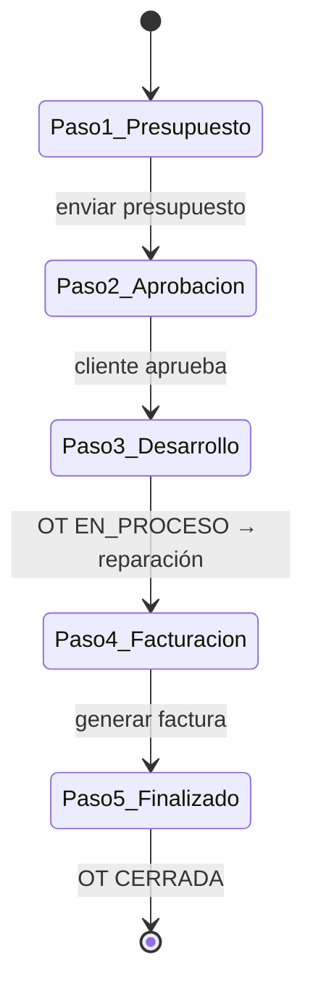
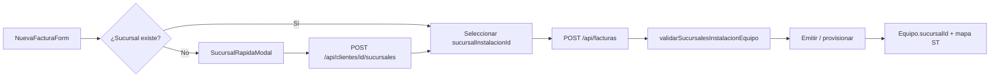

# 13 — Flujos comerciales (OT, presupuesto, factura)

## 1. Flujo OT → comercial (5 pasos UI)

Componente: `components/servicio-tecnico/OTFlujoComercial.tsx`  
Página: `/servicio-tecnico/[id]`



| Paso | Acción usuario | API / ruta | Efecto |
|------|----------------|------------|--------|
| 1 | Crear presupuesto | `POST /api/presupuestos` `{ otId }` | `Presupuesto.otId` FK |
| 1 | Enviar | PATCH presupuesto → ENVIADO | — |
| 2 | Aprobar | PATCH → APROBADO | Habilita paso 3 |
| 3 | Iniciar reparación | PATCH `/api/ots/[id]` estado `EN_PROCESO` | — |
| 4 | Generar factura | `/facturacion/nueva?presupuestoId=&otId=` | Valida presupuesto aprobado |
| 5 | Finalizar | PATCH OT → `CERRADA` | Cierra ciclo |

### Reglas

- Presupuesto desde OT precarga ítems/repuestos (`presupuestos/nuevo?otId=`).
- Repuestos OT persisten vía PATCH `/api/ots/[id]` campo `repuestos`.
- Factura valida en `POST /api/facturas` que presupuesto esté aprobado si viene ligado.

## 2. Presupuesto standalone

| Estado | Transiciones |
|--------|--------------|
| BORRADOR | → ENVIADO |
| ENVIADO | → APROBADO / RECHAZADO / VENCIDO |
| APROBADO | → CONVERTIDO (al facturar) |

API: `app/api/presupuestos/[id]/route.ts`, `convertir/route.ts`.

## 3. Facturación

| Estado Factura | Significado |
|--------------|-------------|
| BORRADOR | Editable |
| PENDIENTE_CAE | En cola AFIP |
| EMITIDA | CAE OK |
| RECHAZADA | AFIP rechazó |
| ANULADA | Nota crédito / baja |

Emisión: `POST /api/facturas/[id]/emitir` → worker AFIP (BullMQ).

PDF: plantilla predeterminada tipo FACTURA + `build-datos.ts`.

## 4. Modelo relacional (extracto)

```
OrdenTrabajo 1 ── * Presupuesto (otId)
Presupuesto 1 ── 0..1 Factura (vía convertir / presupuestoId en factura)
Cliente 1 ── * OT, Presupuesto, Factura
Equipo 1 ── * OT, HistoriaClinicaEntrada
```

Ver `prisma/schema.prisma`: `OrdenTrabajo`, `Presupuesto`, `Factura`, `RepuestoOT`.

## 5. Pantallas relacionadas

| Ruta | Componente principal |
|------|---------------------|
| `/servicio-tecnico/nueva` | `NuevaOTForm` |
| `/servicio-tecnico/[id]` | `OTDetalle`, `OTFlujoComercial` |
| `/presupuestos/nuevo` | `NuevoPresupuestoForm` |
| `/presupuestos/[id]` | Detalle presupuesto |
| `/facturacion/nueva` | `NuevaFacturaForm` |

## 6. Permisos mínimos por rol

| Acción | Permiso |
|--------|---------|
| Ver OT | 🔐 o `servicio.read` |
| Crear OT | `servicio.create` |
| Editar OT / repuestos | `servicio.update` |
| Crear presupuesto | `presupuestos.create` |
| Aprobar presupuesto | `presupuestos.approve` |
| Crear factura | `facturas.create` |
| Emitir AFIP | `facturas.emit_afip` |

Matriz completa: [`01-roles-y-permisos.md`](01-roles-y-permisos.md).

## 7. Venta de equipos + sucursal de instalación

Flujo al facturar ítems con `inventario.tipoArticulo = EQUIPO`:



### Reglas

- **Obligatorio:** cada línea EQUIPO debe tener `sucursalInstalacionId` (cliente + servidor).
- Validación cliente: `lib/facturas/validar-sucursal-equipo-client.ts` (sin Prisma).
- Validación servidor: `lib/facturas/validar-sucursal-equipo.ts`.
- **Carga rápida:** `SucursalRapidaModal` en facturación — calle + número + mapa, sin salir del formulario.
- Provisión: `lib/equipos/provisionar-venta.ts` copia sucursal al `Equipo` y geocodifica.

### Pantallas

| Ruta | Notas |
|------|-------|
| `/crm/nuevo` | Alta cliente con sucursales obligatorias |
| `/facturacion/nueva` | Selector + carga rápida por ítem EQUIPO |
