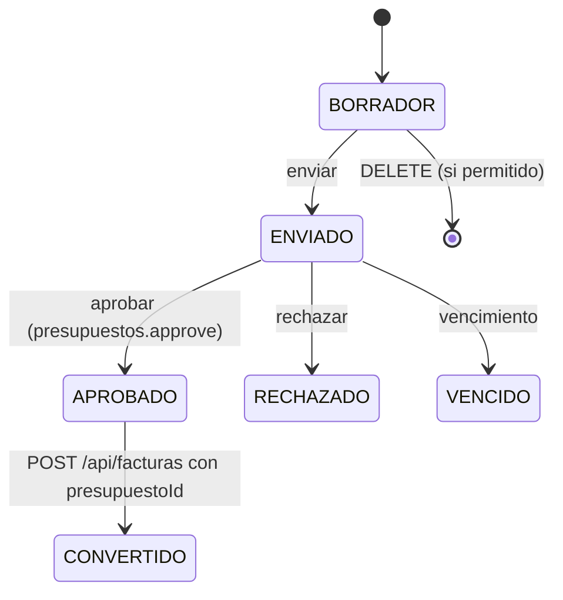
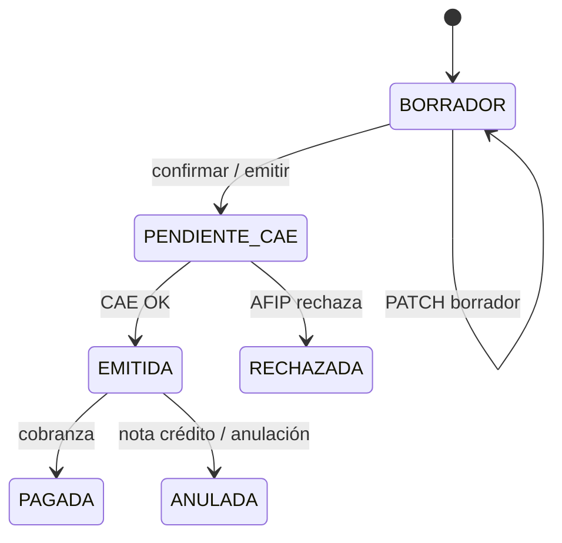
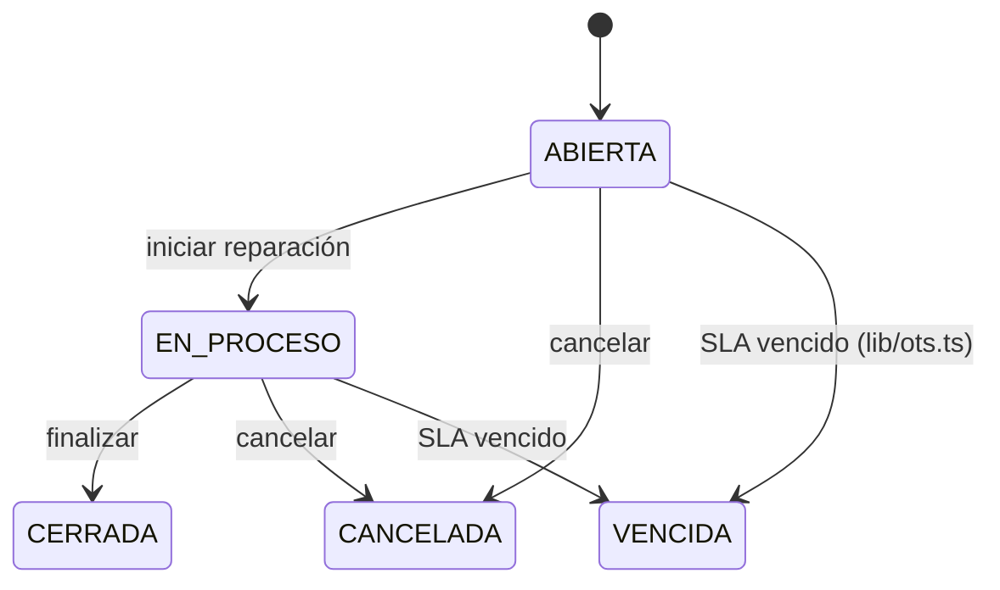
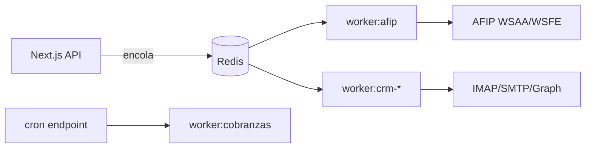

# 15 — Máquinas de estado, workers, seguridad e integraciones

> Complementa [`00-ARQUITECTURA-IMPLEMENTADA.md`](00-ARQUITECTURA-IMPLEMENTADA.md) y [`13-FLUJOS-COMERCIALES.md`](13-FLUJOS-COMERCIALES.md).

---

## 1. Máquinas de estado

Fuente de verdad: `prisma/schema.prisma` (enums). **No inventar transiciones** — validar en API antes de PATCH.

### Presupuesto (`EstadoPresupuesto`)

| Estado | Editable | Facturable |
|--------|----------|------------|
| BORRADOR | ✅ | ❌ |
| ENVIADO | limitado | ❌ |
| APROBADO | ❌ | ✅ |
| CONVERTIDO | ❌ | ya facturado |
| RECHAZADO / VENCIDO | ❌ | ❌ |

### Factura (`EstadoFactura`)

| Estado | Editable | PDF fiscal | Borrado físico |
|--------|----------|------------|----------------|
| BORRADOR | ✅ | preview | — |
| PENDIENTE_CAE | ❌ | — | ❌ |
| EMITIDA | ❌ | ✅ + QR | ❌ |
| ANULADA | ❌ | histórico | ❌ |

> `PENDIENTE` es legado pre-AFIP; nuevas facturas usan `PENDIENTE_CAE` → `EMITIDA`.

### Orden de trabajo (`EstadoOT`)

**SLA:** `lib/ots.ts` → `actualizarOTsVencidas()` en lecturas de listado/detalle.

### Orden de compra (`EstadoOrdenCompra`)

`BORRADOR` → `ENVIADA` → `PARCIAL` / `RECIBIDA` → `CANCELADA` (ver `app/api/ordenes-compra/`).

---

## 2. Matriz implementación vs roadmap

| Fase | Tema | Estado | Notas |
|------|------|--------|-------|
| F1 | RBAC, usuarios, auditoría, Decimal, storage | ✅ | Ver `10-roadmap.md` |
| F2 | Producto vs Equipo, kardex avanzado | 🟡 | Inventario + movimientos básicos |
| F3 | Presupuestos + plantillas PDF + editor | ✅ | `12-PLANTILLAS-PDF.md` |
| F4 | AFIP WSAA/WSFE, CAE, cola | 🟡 | Emisión + worker; homolog→prod manual |
| F5 | Cobranzas, vencimientos | ✅ | Worker + cron opcional |
| F6 | Proveedores + OC | ✅ | Recepción → stock |
| F7 | OT + preventivo | ✅ | Flujo comercial 5 pasos |
| F8 | Tracking + mapa | ✅ | Leaflet |
| F9 | CRM omnicanal + n8n | 🟡 | Inbox, webhooks; canales según config |
| F10 | Clientes 360, reportes | 🟡 | Métricas parciales, reportes básicos |

Leyenda: ✅ operativo · 🟡 parcial · ❌ pendiente

---

## 3. Workers y jobs en background

| Proceso | Comando | Cola / trigger | Archivo |
|---------|---------|----------------|---------|
| Emisión AFIP | `npm run worker:afip` | BullMQ + Redis | `worker/afip-worker.ts` |
| Email CRM (IMAP) | `npm run worker:crm-email` | polling `CRM_EMAIL_POLL_MS` | `worker/crm-email-worker.ts` |
| Graph CRM | `npm run worker:crm-graph` | polling `CRM_GRAPH_POLL_MS` | `worker/crm-graph-worker.ts` |
| Vencimientos cobranza | `npm run worker:cobranzas` | polling | `worker/cobranzas-vencimientos-worker.ts` |
| Cron HTTP | — | `POST /api/cron/cobranzas-vencimientos` + `CRON_SECRET` | `app/api/cron/` |

**Dev:** workers son opcionales; sin Redis, emisión AFIP puede fallar en cola — ver logs y `.env`.

### Scripts de verificación

| Comando | Qué valida |
|---------|------------|
| `npm run smoke` | Prisma, contabilidad, historia clínica |
| `npm run e2e` | Sucursales, CRM historial, geocoding, rutas API |
| `npm run e2e:all` | Ambos |

Ver [`DEV-ESTABILIDAD.md`](DEV-ESTABILIDAD.md).

---

## 4. Modelo de seguridad (capas)

| Capa | Mecanismo | Alcance | Autoritativo |
|------|-----------|---------|--------------|
| 1 | `middleware.ts` | Cookie sesión en `(dashboard)/*` | Solo “logueado sí/no” |
| 2 | `requirePermission()` | Cada `app/api/**/route.ts` | **Sí** |
| 3 | `requirePagePermission()` | Server pages | Redirect si falta permiso |
| 4 | `useCan()` | Componentes cliente | Solo UX (ocultar botones) |
| 5 | Headers CSP / X-Frame-Options | `lib/security/headers.ts` | PDF vía blob, no iframe |
| 6 | Rate limit login | Redis + `lib/auth/login-rate-limit.ts` | Brute-force |
| 7 | API keys | n8n (`N8N_API_KEY`), cron (`CRON_SECRET`) | Rutas públicas acotadas |
| 8 | Webhooks Meta | Verify token + firma | `/api/webhooks/*` |

**Regla:** nunca confiar solo en `useCan` para autorizar una acción.

---

## 5. Contratos de integración

### n8n (header `Authorization: Bearer <N8N_API_KEY>`)

| Endpoint | Body principal | Efecto |
|----------|----------------|--------|
| `POST /api/n8n/crear-lead` | datos cliente/contacto | Crea o vincula lead CRM |
| `POST /api/n8n/crear-ot` | `{ clienteId, descripcion, equipoId?, prioridad?, slaHoras?, conversacionId? }` | OT `ABIERTA` + historial |
| `POST /api/n8n/responder` | conversación + mensaje | Envía respuesta canal |
| `POST /api/n8n/etiquetar` | conversación + etiquetas | Tags CRM |

Schemas Zod en cada `app/api/n8n/*/route.ts`.

### Meta (WhatsApp / Messenger / Instagram)

- `GET /api/webhooks/whatsapp` — challenge verify (`META_VERIFY_TOKEN`)
- `POST` — firma HMAC; ingest vía `lib/crm/ingest.ts`
- Config canal: `/api/integraciones/canales/[tipo]`

### Microsoft Graph (correo)

1. `GET /api/integraciones/graph/authorize` — inicia OAuth (sesión + permiso integraciones)
2. `GET /api/integraciones/graph/callback` — callback con `state` firmado (sin sesión)
3. Worker `crm-graph-worker` hace polling

### Variables críticas

Ver `.env.local.example`: `DATABASE_URL`, `NEXTAUTH_*`, `REDIS_URL`, `N8N_API_KEY`, `INTEGRATION_SECRET`, `CRON_SECRET`, `AFIP_ACCESS_TOKEN`, `STORAGE_*`.

---

## 6. Errores frecuentes al tocar estados

| Síntoma | Causa | Doc |
|---------|-------|-----|
| “Presupuesto no aprobado” al facturar | Estado ≠ `APROBADO` | §1 Presupuesto |
| Factura no emite CAE | Worker AFIP caído / certificado | §3, `02-facturacion-afip.md` |
| OT no avanza en wizard | Presupuesto sin `otId` o estado OT | `13-FLUJOS-COMERCIALES.md` |
| Preview PDF colgada | 3 PDFs paralelos en dev | `12-PLANTILLAS-PDF.md` |
