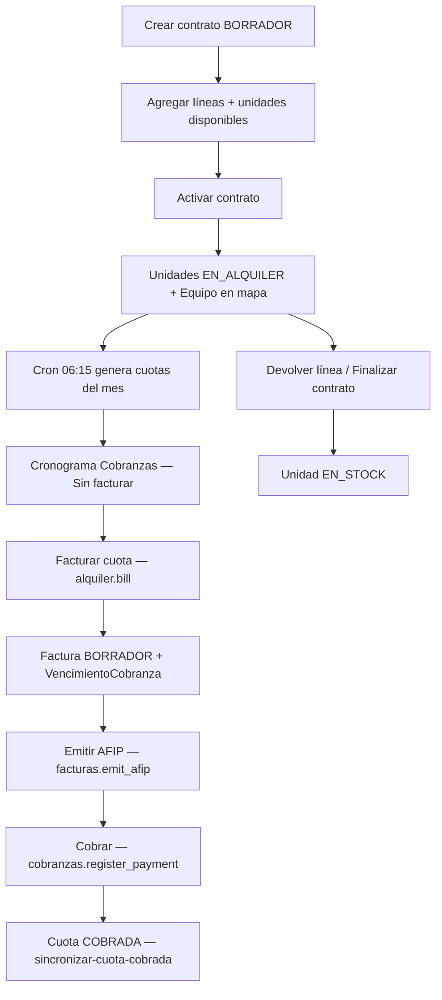

# 24 · Alquiler de equipos

> **Documento canónico** del módulo de alquiler recurrente de equipos biomédicos.  
> Integrado con inventario, facturación AFIP, cobranzas y mapa de servicio técnico.

**Fuente de verdad en código:** `prisma/schema.prisma` (§ ALQUILER) · `lib/alquiler/*` · `lib/cobranzas/cronograma-cobranzas.ts`

---

## 1. Objetivo

Gestionar contratos de alquiler mensual de unidades de inventario serializadas hacia clientes (hospitales, clínicas, organismos públicos), con:

- Trazabilidad de unidad (`InventarioUnidad` → `EN_ALQUILER`)
- Cuotas mensuales automáticas (cron)
- Facturación fiscal obligatoria antes de cobrar
- Cronograma unificado en **Cobranzas**
- Reportes CSV (parque, cuotas, MRR)
- Posición en mapa ST (beneficiario / domicilio de entrega)

---

## 2. Modelo de datos

| Entidad | Tabla | Rol |
|---------|-------|-----|
| `ContratoAlquiler` | `contratos_alquiler` | Cabecera: cliente, estado, día de facturación |
| `LineaAlquiler` | `lineas_alquiler` | Una unidad alquilada + beneficiario + geo |
| `CuotaAlquiler` | `cuotas_alquiler` | Cuota mensual por línea (`lineaId` + `periodo` únicos) |

### Estados — contrato (`EstadoContratoAlquiler`)

| Estado | Significado |
|--------|-------------|
| `BORRADOR` | Editable; unidades aún en stock |
| `ACTIVO` | En curso; cron genera cuotas; unidades `EN_ALQUILER` |
| `SUSPENDIDO` | Pausado; **no** genera cuotas nuevas; cuotas pendientes siguen visibles |
| `FINALIZADO` | Cerrado normalmente (devolución de líneas) |
| `CANCELADO` | Anulado desde borrador o activo |

### Estados — cuota (`EstadoCuotaAlquiler`)

| Estado | Significado |
|--------|-------------|
| `PENDIENTE` | Generada, sin facturar |
| `VENCIDA` | Pasó `vencimiento` sin cobrar (cron marca) |
| `FACTURADA` | Tiene `facturaId` (BORRADOR o emitida) |
| `COBRADA` | Factura pagada (sync desde cobranzas) |
| `ANULADA` | Contrato cancelado / línea devuelta antes de facturar |

### Inventario

Al **activar** contrato: `InventarioUnidad.estado` → `EN_ALQUILER`, se crea/vincula `Equipo` con coords del beneficiario.  
Al **devolver línea** o **finalizar**: `devolverUnidadDeAlquiler` → `EN_STOCK` (si aplica).

---

## 3. Flujo operativo punta a punta

### Regla fiscal (no negociable)

Las cuotas **sin factura emitida AFIP** aparecen en el cronograma de Cobranzas pero **no** en el formulario de imputación de pago. Siempre: Facturar → Emitir AFIP → Cobrar.

---

## 4. Cobranzas — cronograma unificado

| Archivo | Rol |
|---------|-----|
| `lib/cobranzas/cronograma-cobranzas.ts` | Merge `VencimientoCobranza` + grupos cuota alquiler sin `facturaId` |
| `GET /api/cobranzas/vencimientos?origen=` | `TODOS` \| `FACTURA` \| `ALQUILER` |
| `components/cobranzas/VencimientosProximos.tsx` | Badges + botones Facturar / Emitir AFIP / Cobrar |
| `components/cobranzas/CobranzasForm.tsx` | `?cliente=` preselecciona cliente |

Badges típicos: **Sin facturar** · **Pendiente AFIP** · **Por cobrar**

---

## 5. Facturación de cuotas

| Archivo | Rol |
|---------|-----|
| `lib/alquiler/facturar-cuotas.ts` | Crea factura BORRADOR, vincula cuotas, crea `VencimientoCobranza` |
| `POST /api/alquiler/contratos/[id]/facturar` | Body: `{ periodo }` · permiso `alquiler.bill` |

Una factura puede agrupar todas las líneas del mismo contrato + período.

---

## 5b. ACTA de entrega (documento firmable)

Comprobante de entrega física del equipo al beneficiario. **Independiente de la factura**: se puede imprimir ACTA sin factura, factura sin ACTA, o ambos vinculados.

| Archivo | Rol |
|---------|-----|
| `ActaEntregaAlquiler` | Snapshot editable: cliente, equipo, montos, depósito de garantía |
| `lib/alquiler/acta-entrega.ts` | Crear / actualizar / listar |
| `lib/alquiler/acta-pdf.ts` | PDF HTML (mismo encabezado fiscal que factura) |
| `POST /api/alquiler/contratos/[id]/actas` | Crear · permiso `alquiler.bill` |
| `GET /api/alquiler/actas/[id]/pdf` | Descargar PDF · permiso `alquiler.read` |

Numeración: secuencia `ACTA_ALQUILER_{año}` (ej. `ACTA-2026-0001`).

UI: botón **ACTA** por línea en `ContratoAlquilerDetalle`; tras facturar desde Cobranzas, toast con enlace al contrato para generar ACTAs.

---

## 6. Cron y jobs

| Trigger | Horario VPS | lib |
|---------|-------------|-----|
| `POST /api/cron/alquiler-cuotas` | 06:15 diario | `lib/alquiler/procesar-cuotas-alquiler.ts` |
| `npm run cron:alquiler-cuotas` | Alternativa local | `scripts/alquiler-cuotas-cron.ts` |

Pasos del job (idempotente):

1. `generar-cuotas-mes.ts` — cuotas para contratos `ACTIVO` (unique `lineaId` + `periodo`)
2. `marcar-cuotas-vencidas.ts` — `PENDIENTE` → `VENCIDA` si `vencimiento < hoy`

Corre **después** de cobranzas (06:00). Ver [`00-INFRAESTRUCTURA.md`](00-INFRAESTRUCTURA.md) §4.

---

## 7. Ciclo de vida — API

| Acción | Ruta | Permiso | lib |
|--------|------|---------|-----|
| Listar / crear | `GET/POST /api/alquiler/contratos` | read / create | — |
| Detalle / editar | `GET/PATCH /api/alquiler/contratos/[id]` | read / update | — |
| Activar | `POST .../activar` | `alquiler.update` | `activar-contrato.ts` |
| Suspender | `POST .../suspender` | `alquiler.update` | `estado-contrato.ts` |
| Finalizar | `POST .../finalizar` | `alquiler.close` | `finalizar-contrato.ts` |
| Cancelar | `POST .../cancelar` | `alquiler.close` | `estado-contrato.ts` |
| Facturar período | `POST .../facturar` | `alquiler.bill` | `facturar-cuotas.ts` |
| Devolver línea | `POST /api/alquiler/lineas/[id]/devolver` | `alquiler.close` | `devolver-linea.ts` |
| Unidades disponibles | `GET /api/alquiler/unidades-disponibles` | `alquiler.read` | — |
| Resumen KPIs | `GET /api/alquiler/resumen` | `alquiler.read` | `resumen.ts` |

---

## 8. UI

| Ruta | Componente | Permiso página |
|------|------------|----------------|
| `/alquiler` | `AlquilerDashboard.tsx` | `alquiler.read` |
| `/alquiler/contratos/nuevo` | `NuevoContratoAlquilerForm.tsx` | `alquiler.create` |
| `/alquiler/contratos/[id]` | `ContratoAlquilerDetalle.tsx` | `alquiler.read` |

Sidebar: **Alquiler** → `/alquiler` · Middleware: `/alquiler/:path*`

---

## 9. Permisos RBAC

| Permiso | Descripción |
|---------|-------------|
| `alquiler.read` | Ver contratos y reportes |
| `alquiler.create` | Crear contratos |
| `alquiler.update` | Editar, activar, suspender |
| `alquiler.close` | Finalizar, cancelar, devolver línea |
| `alquiler.bill` | Facturar cuotas desde contrato o Cobranzas |
| `alquiler.export` | Export CSV |

Roles con facturación: `GERENTE`, `ADMINISTRACION`, `FACTURACION`.  
Ventas: read/create/update (sin bill). Técnico: solo read.

Fuente: `lib/rbac.ts` · diseño: [`01-roles-y-permisos.md`](01-roles-y-permisos.md)

---

## 10. Reportes CSV

| Export | API | lib |
|--------|-----|-----|
| Parque en alquiler | `GET /api/reportes/alquiler-parque` | `lib/reportes-alquiler-parque.ts` |
| Cuotas por período | `GET /api/reportes/alquiler-cuotas?periodo=YYYY-MM` | `lib/reportes-alquiler-cuotas.ts` |
| MRR | `GET /api/reportes/alquiler-mrr` | `lib/reportes-alquiler-mrr.ts` |

UI: `/reportes` → `ReportesCsvCentro.tsx` · permiso `alquiler.export` o `reportes.read_*`

---

## 11. Mapa y tracking

- Filtro **Alquilado** en `components/tracking/TrackingMap.tsx`
- `lib/tracking.ts` — origen `ALQUILER`, coords desde `LineaAlquiler` (beneficiario)
- `GET /api/tracking/mapa` — incluye equipos en alquiler activo

---

## 12. Alertas e inbox (campana del header)

| Archivo | Rol |
|---------|-----|
| `lib/alquiler/alertas-cobranza.ts` | Grupos por contrato + período + **situación de cobro** |
| `lib/notificaciones/generar-inbox.ts` | Reglas `cobranza.vencida` / `cobranza.proximo` |

**Situaciones que generan alerta** (usuarios con `cobranzas.read` o `alquiler.bill`):

| Situación | Cuándo | Acción en campana |
|-----------|--------|-------------------|
| `SIN_FACTURAR` | Cuota vencida o próxima sin factura | → Cobranzas (origen ALQUILER) · Facturar |
| `PENDIENTE_AFIP` | Factura borrador / pendiente CAE | → Facturación · Emitir AFIP |
| `POR_COBRAR` | Factura emitida impaga | → Cobranzas · Cobrar cliente |

Vencidas = urgente · Próximas = importante (anticipación configurable en regla `cobranza.proximo`, default 3 días).

Claves dedup: `alquiler-cuota-vencida:{contratoId}:{periodo}:{situacion}`

Las facturas de alquiler **no duplican** alertas genéricas de `VencimientoCobranza` (se muestran solo como alerta alquiler).

---

## 13. Sync cobranza → cuota

Al registrar pago que salda factura de alquiler:

- `lib/alquiler/sincronizar-cuota-cobrada.ts`
- Hook en `app/api/cobranzas/route.ts` y `lib/cobranzas/cheques.ts`

---

## 14. Invariantes

Ver [`INVARIANTES.md`](INVARIANTES.md) § Alquiler (Al1–Al5).

---

## 15. Migración

`prisma/migrations/20260620120000_modulo_alquiler_equipos/`

Post-deploy: `npx prisma migrate deploy && npx prisma generate`

---

## 16. Archivos clave (`lib/alquiler/`)

| Archivo | Responsabilidad |
|---------|-----------------|
| `activar-contrato.ts` | BORRADOR → ACTIVO, stock, equipos |
| `generar-cuotas-mes.ts` | Cuotas del período actual |
| `marcar-cuotas-vencidas.ts` | PENDIENTE → VENCIDA |
| `procesar-cuotas-alquiler.ts` | Orquestador cron |
| `facturar-cuotas.ts` | Factura + vencimiento cobranza |
| `sincronizar-cuota-cobrada.ts` | Pago → cuota COBRADA |
| `devolver-linea.ts` / `finalizar-contrato.ts` | Cierre operativo |
| `estado-contrato.ts` | Suspender / cancelar |
| `alertas-cobranza.ts` | Dashboard + inbox |
| `periodo.ts` | Formato `YYYY-MM` |
| `resumen.ts` | KPIs módulo |

---

*Última actualización: módulo alquiler equipos — integración cobranzas unificada.*
