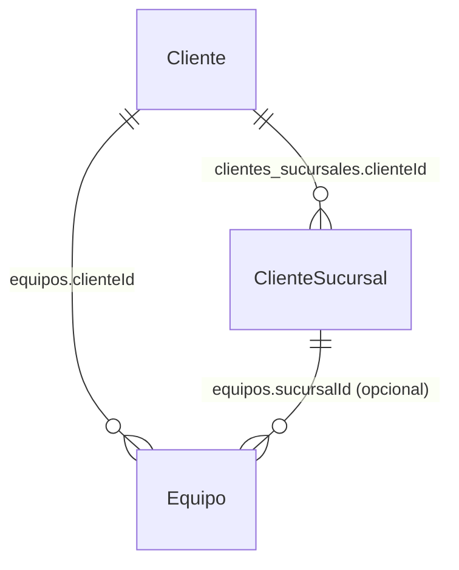
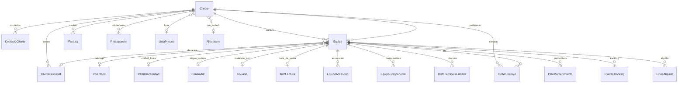
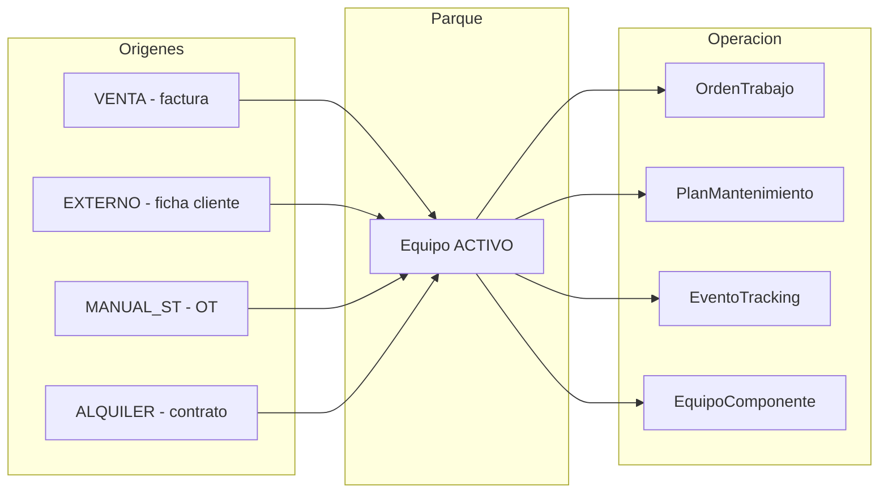

# Clientes y Equipos — Modelo de datos + API

> Referencia técnica para integración y handoff.  
> **Fuente de verdad en código:** `prisma/schema.prisma`, `lib/validation.ts`, `app/api/clientes/**`, `app/api/equipos/**`  
> **Base URL producción:** `https://erp-ibiomedica.com.ar`

---

## Índice

1. [Diagrama de relaciones](#1-diagrama-de-relaciones)
2. [Cliente](#2-cliente)
3. [ClienteSucursal](#3-clientesucursal)
4. [ContactoCliente](#4-contactocliente)
5. [Métricas 360°](#5-métricas-360)
6. [Equipo](#6-equipo)
7. [EquipoAccesorio](#7-equipoaccesorio)
8. [EquipoComponente](#8-equipocomponente)
9. [HistoriaClinicaEntrada](#9-historiaclinicaentrada)
10. [API Clientes](#10-api-clientes)
11. [API Equipos](#11-api-equipos)
12. [Flujos de vida del equipo](#12-flujos-de-vida-del-equipo)
13. [Reglas de negocio](#13-reglas-de-negocio)
14. [Permisos RBAC](#14-permisos-rbac)

---

## 1. Diagrama de relaciones

### Relación Cliente ↔ Equipo (tabla de enlace)

**No existe tabla puente.** La relación es **1:N directa**: cada equipo pertenece a un solo cliente mediante FK en `equipos`.

| Tabla BD | Campo FK | Referencia | Cardinalidad | Índice |
|----------|----------|------------|--------------|--------|
| `equipos` | `clienteId` | `clientes.id` | N equipos → 1 cliente | `@@index([clienteId])` |

**Opcional — ubicación del equipo en sede del cliente:**

| Tabla BD | Campo FK | Referencia | Cardinalidad |
|----------|----------|------------|--------------|
| `equipos` | `sucursalId` | `clientes_sucursales.id` | N equipos → 0..1 sucursal |
| `clientes_sucursales` | `clienteId` | `clientes.id` | N sucursales → 1 cliente |

Cadena completa: **Cliente** `1 ──<` **ClienteSucursal** `1 ──<` **Equipo** (vía `sucursalId`, opcional)  
Siempre: **Cliente** `1 ──<` **Equipo** (vía `clienteId`, obligatorio)

```sql
-- Consulta típica: equipos de un cliente
SELECT e.* FROM equipos e
WHERE e.cliente_id = :clienteId;

-- Equipos por sucursal (subset del mismo cliente)
SELECT e.* FROM equipos e
JOIN clientes_sucursales s ON e.sucursal_id = s.id
WHERE s.cliente_id = :clienteId AND s.activo = true;
```

**Reglas:**
- Un equipo **siempre** tiene `clienteId` (no puede existir sin cliente) — refleja la **asignación activa**.
- `sucursalId` es opcional; si se setea, la sucursal debe ser del **mismo** cliente.
- El **historial de dueños** vive en `equipos_asignaciones` (vigencia desde/hasta, tipo). Traslados vía `POST /api/equipos/:id/trasladar`.
- Sigue sin haber multi-cliente simultáneo: una sola asignación `activa` por equipo.



---



---

## 2. Cliente

**Tabla:** `clientes` · **Modelo Prisma:** `Cliente`

| Campo | Tipo | Obligatorio | Descripción |
|-------|------|-------------|-------------|
| `id` | string (cuid) | auto | PK |
| `nombre` | string | sí | Razón social / nombre |
| `tipo` | TipoCliente | sí | Ver enum abajo |
| `cuit` | string? | no | CUIT |
| `direccion` | string? | no | Domicilio fiscal |
| `ciudad` | string? | no | |
| `telefono` | string? | no | Validación de formato |
| `email` | string? | no | Email válido o vacío |
| `contacto` | string? | no | Contacto principal legacy (texto libre) |
| `activo` | boolean | default `true` | Soft delete |
| `creadoEn` | DateTime | auto | |
| `condicionIva` | string? | no | ej. Responsable Inscripto, CF |
| `condicionPago` | string? | no | ej. Contado, 30 días |
| `limiteCredito` | float? | no | ARS; null = sin límite |
| `segmento` | string? | no | Override manual (VIP, etc.) |
| `sitioWeb` | string? | no | |
| `notas` | string? | no | Máx. 1000 caracteres |
| `lat`, `lng` | float? | no | Geocodificación sede fiscal |
| `alicuotaIvaId` | FK? | no | → `AlicuotaIva` |
| `listaPreciosId` | FK? | no | → `ListaPrecios` |
| `esMayorista` | boolean | default false | |
| `monedaPreferida` | string? | no | `ARS` \| `USD` |

### Enum `TipoCliente`

```
HOSPITAL | CLINICA | CONSULTORIO | SANATORIO | ORGANISMO_PUBLICO | OTRO
```

### Relaciones

| Cardinalidad | Entidad | Notas |
|--------------|---------|-------|
| 1:N | `ClienteSucursal` | Sedes de instalación |
| 1:N | `ContactoCliente` | Multi-contacto (sin API REST dedicada) |
| 1:N | `Equipo` | Parque instalado |
| 1:N | `OrdenTrabajo` | OTs |
| 1:N | `Factura`, `Presupuesto`, `Pago` | Comercial |
| 1:N | `NegocioEmbudo`, `ConversacionCRM` | CRM |
| 1:N | `ContratoAlquiler`, `OrdenVenta`, `RemitoVenta` | Operaciones |

### Cliente Eventual (especial)

| Campo | Valor |
|-------|-------|
| ID fijo | `cliente-eventual` |
| Nombre | `Cliente Eventual` |
| Uso | Presupuestos/ventas ocasionales sin ficha completa |
| Runtime | `ensureClienteEventual()` en `lib/clientes/eventual.ts` |

---

## 3. ClienteSucursal

**Tabla:** `clientes_sucursales` · **Modelo Prisma:** `ClienteSucursal`

| Campo | Tipo | Descripción |
|-------|------|-------------|
| `id` | cuid | PK |
| `clienteId` | FK | → Cliente |
| `nombre` | string | ej. "Sede principal", "Guardia" |
| `direccion`, `numero`, `ciudad` | string? | Dirección de instalación |
| `lat`, `lng` | float? | Geocodificado automáticamente |
| `activo` | boolean | Soft delete |
| `notas` | string? | |
| `creadoEn` | DateTime | |

**Reglas:**

- Al **crear** cliente debe existir al menos una sucursal.
- Si no se envían sucursales pero hay domicilio fiscal, se crea `"Sede principal"` automáticamente (`lib/clientes/crear-cliente.ts`).
- Los equipos se vinculan con `Equipo.sucursalId`.
- Al facturar equipos se exige `ItemFactura.sucursalInstalacionId`.

---

## 4. ContactoCliente

**Tabla:** `contactos_cliente` · **Modelo Prisma:** `ContactoCliente`

| Campo | Tipo | Descripción |
|-------|------|-------------|
| `id` | cuid | PK |
| `clienteId` | FK | |
| `nombre` | string | |
| `cargo` | string? | |
| `email`, `telefono` | string? | |
| `principal` | boolean | Usado en notificaciones automáticas |
| `creadoEn` | DateTime | |

**Nota:** existe en BD y se carga en la ficha del cliente (`app/(dashboard)/clientes/[id]/page.tsx`), pero **no hay endpoints REST** para CRUD de contactos. Las notificaciones (presupuesto, factura, cobranza, OT) buscan contacto con `principal: true`.

---

## 5. Métricas 360°

**Endpoint:** `GET /api/clientes/:id/metricas`  
**Cálculo:** `lib/clientes-metrics.ts` (on-demand desde facturas, no persistido)

### Objeto `metricas`

| Grupo | Campos |
|-------|--------|
| **Valor** | `totalComprado`, `cantidadCompras`, `ticketPromedio` |
| **Recurrencia** | `primeraCompra`, `ultimaCompra`, `diasDesdeUltimaCompra`, `frecuenciaMediaDias`, `proximaCompraEstimada`, `enRiesgo` |
| **Pago** | `saldoActual`, `deudaVencida`, `aging` (0-30, 31-60, 61-90, 90+), `dsoAprox`, `scorePago`, `semaforoPago`, `limiteCredito`, `creditoDisponible` |
| **Segmentación** | `rfm` (recencia, frecuencia, monto, score), `segmento` |
| **Productos** | `topProductos[]` |

### Enum `SemaforoPago`

`VERDE` | `AMARILLO` | `ROJO`

### Enum `SegmentoCliente`

`VIP` | `RECURRENTE` | `NUEVO` | `EN_RIESGO` | `MOROSO` | `INACTIVO`

---

## 6. Equipo

**Tabla:** `equipos` · **Modelo Prisma:** `Equipo`

Activo instalado en un cliente (parque). Distinto del catálogo `Inventario`.

| Campo | Tipo | Descripción |
|-------|------|-------------|
| `id` | cuid | PK |
| `nombre` | string | Identificación |
| `marca`, `modelo`, `modeloExacto` | string? | |
| `numeroSerie` | string? | **Unique global** |
| `codigoInterno` | string? | Código interno IB |
| `firmwareVersion`, `softwareVersion` | string? | |
| `garantiaHasta` | DateTime? | |
| `estado` | EstadoEquipo | Ver enum |
| `clienteId` | FK | → Cliente (obligatorio) |
| `sucursalId` | FK? | → ClienteSucursal |
| `inventarioId` | FK? | → Inventario (catálogo) |
| `origen` | OrigenEquipo | Ver enum |
| `ubicacionLat`, `ubicacionLng` | float? | Geocodificado |
| `direccionUbicacion` | string? | |
| `pisoSala` | string? | |
| `contactoResponsable` | string? | En sitio |
| `fechaInstalacion` | DateTime? | |
| `servicioInstalacion` | string? | |
| `instaladoPorUsuarioId` | FK? | → Usuario |
| `proveedorOrigenId` | FK? | → Proveedor |
| `referenciaCompra` | string? | OC / factura compra |
| `notasTecnicas` | string? | |
| `creadoEn` | DateTime | |

### Enum `EstadoEquipo`

```
ACTIVO | EN_REPARACION | BAJA
```

### Enum `OrigenEquipo`

| Valor | Origen |
|-------|--------|
| `VENTA` | `POST /api/facturas/:id/provisionar-equipos` |
| `ALQUILER` | Contrato de alquiler |
| `EXTERNO` | `POST /api/clientes/:id/equipos` |
| `MANUAL_ST` | Alta desde OT con `equipoNuevo` |

### Relaciones 1:1

| Relación | Entidad | Significado |
|----------|---------|-------------|
| `unidadInventario` | InventarioUnidad | Unidad física vendida/alquilada |
| `itemFacturaOrigen` | ItemFactura | Línea de factura que generó el equipo |

---

## 7. EquipoAccesorio

**Tabla:** `equipo_accesorios`

| Campo | Tipo | Descripción |
|-------|------|-------------|
| `equipoId` | FK | |
| `nombre` | string | |
| `inventarioId` | FK? | Vínculo opcional al catálogo |
| `cantidad` | int | default 1 |
| `obligatorio` | boolean | |
| `notas` | string? | |

---

## 8. EquipoComponente

**Tabla:** `equipo_componentes` — baterías, filtros, calibraciones con vencimiento.

| Campo | Tipo | Descripción |
|-------|------|-------------|
| `tipo` | TipoComponenteEquipo | Ver enum |
| `descripcion` | string | |
| `numeroSerie` | string? | |
| `instaladoEn`, `venceEn` | DateTime? | |
| `alertaDiasAntes` | int | default 30 |
| `activo` | boolean | Soft delete |
| `notas` | string? | |

### Enum `TipoComponenteEquipo`

```
BATERIA | FILTRO | CALIBRACION | SENSOR | OTRO
```

---

## 9. HistoriaClinicaEntrada

**Tabla:** `historia_clinica_entradas` — bitácora / timeline del equipo.

| Campo | Tipo | Descripción |
|-------|------|-------------|
| `equipoId` | FK | |
| `tipo` | TipoEntradaHistoriaClinica | Ver enum |
| `titulo`, `contenido` | string | |
| `referenciaId` | string? | ID OT, componente, etc. |
| `usuarioId` | FK? | |
| `fecha` | DateTime | |

### Enum `TipoEntradaHistoriaClinica`

```
OT | PREVENTIVO | NOTA | INSTALACION | COMPONENTE | TRACKING | CAMBIO_ESTADO
```

La bitácora unificada en `GET /api/equipos/:id` agrega OTs, tracking y preventivos (`lib/equipos/historia-clinica.ts` → `construirBitacora`).

---

## 10. API Clientes

**Permisos:** `clientes.read` | `create` | `update` | `deactivate` | `export`  
**Auth:** cookie de sesión NextAuth (`credentials: 'include'`)

### Listado

```
GET /api/clientes?q=&tipo=
```

- `q`: busca en nombre, ciudad, contacto
- `tipo`: filtro TipoCliente
- Respuesta: clientes activos + `_count: { equipos, ots }`

### Alta

```
POST /api/clientes
```

**Body** (`clienteCreateSchema` — `lib/validation.ts`):

```json
{
  "nombre": "Hospital Central",
  "tipo": "HOSPITAL",
  "cuit": "30-12345678-9",
  "direccion": "Av. Principal 100",
  "ciudad": "Formosa",
  "telefono": "+543704123456",
  "email": "compras@hospital.com",
  "contacto": "Dr. García",
  "condicionIva": "Responsable Inscripto",
  "condicionPago": "30 días",
  "limiteCredito": 500000,
  "segmento": "VIP",
  "alicuotaIvaId": "clxxx",
  "listaPreciosId": "clxxx",
  "esMayorista": false,
  "monedaPreferida": "ARS",
  "sucursales": [
    {
      "nombre": "Guardia",
      "direccion": "Av. Principal",
      "numero": "100",
      "ciudad": "Formosa",
      "lat": null,
      "lng": null,
      "notas": null
    }
  ]
}
```

Respuesta **201:** cliente + sucursales creadas. Geocodifica domicilio fiscal y sucursales.

### Detalle

```
GET /api/clientes/:id
```

Incluye: `equipos`, últimas 20 `ots`, últimas 10 `facturas`, `_count`. Auditoría de acceso sensible.

### Actualización

```
PATCH /api/clientes/:id
```

Todos los campos del alta son opcionales + `activo: boolean`.  
Si cambia dirección/ciudad → re-geocodifica y actualiza equipos del cliente.  
**Sucursales en PATCH se ignoran** — usar endpoints de sucursales.

### Baja

```
DELETE /api/clientes/:id
```

Soft delete: `activo: false`.

### Sucursales

| Método | Ruta | Permiso |
|--------|------|---------|
| GET | `/api/clientes/:id/sucursales` | auth |
| POST | `/api/clientes/:id/sucursales` | `clientes.update` o `facturas.create` |
| PATCH | `/api/clientes/:id/sucursales/:sucursalId` | `clientes.update` |
| DELETE | `/api/clientes/:id/sucursales/:sucursalId` | `clientes.update` (soft) |

**Schema sucursal** (`sucursalInstalacionCreateSchema`):

```json
{
  "nombre": "Guardia",
  "direccion": "Av. Principal",
  "numero": "100",
  "ciudad": "Formosa",
  "lat": null,
  "lng": null,
  "notas": null,
  "activo": true
}
```

### Equipos del cliente

| Método | Ruta | Descripción |
|--------|------|-------------|
| POST | `/api/clientes/:id/equipos` | Alta equipo EXTERNO |
| GET | `/api/clientes/:id/equipos/:equipoId/facturas` | Facturas del equipo |

**POST body** (`equipoClienteCreateSchema`):

```json
{
  "nombre": "Monitor Mindray ePM 12",
  "marca": "Mindray",
  "modelo": "ePM 12",
  "numeroSerie": "SN-12345",
  "notasTecnicas": "Equipo del cliente, ingresó por ST"
}
```

- Permiso: `clientes.update`
- Valida SN único (409 si duplica)
- Crea entrada automática en historia clínica

### Otros endpoints

| Método | Ruta | Descripción |
|--------|------|-------------|
| GET | `/api/clientes/:id/metricas` | Ficha 360° calculada |
| GET | `/api/clientes/:id/historial` | OTs + ítems facturados (CRM) |
| GET | `/api/clientes/consultar-arca?cuit=` | Consulta CUIT AFIP/ARCA |
| GET | `/api/clientes/export` | Export CSV |
| GET | `/api/clientes/plantilla` | Plantilla import |
| POST | `/api/clientes/import` | Import masivo |

---

## 11. API Equipos

**Permisos:** `servicio.read` | `servicio.update`  
Los equipos viven bajo el módulo **servicio técnico**.

### Ficha completa + bitácora

```
GET /api/equipos/:id
```

Respuesta (`getEquipoHistoriaCompleta`):

```json
{
  "equipo": {
    "cliente": {},
    "proveedorOrigen": {},
    "instaladoPor": {},
    "itemFacturaOrigen": { "factura": {}, "inventario": {} },
    "unidadInventario": { "deposito": {} },
    "inventario": {},
    "accesorios": [],
    "componentes": [],
    "planes": [],
    "ots": []
  },
  "bitacora": [
    {
      "id": "...",
      "tipo": "OT",
      "titulo": "...",
      "contenido": "...",
      "fecha": "...",
      "referenciaId": "...",
      "usuarioNombre": "...",
      "origen": "historia|ot|tracking|preventivo"
    }
  ]
}
```

### Actualización

```
PATCH /api/equipos/:id
```

Campos: `nombre`, `marca`, `modelo`, `modeloExacto`, `codigoInterno`, `firmwareVersion`, `softwareVersion`, `servicioInstalacion`, `pisoSala`, `contactoResponsable`, `notasTecnicas`, `referenciaCompra`, `proveedorOrigenId`, `fechaInstalacion`, `direccionUbicacion`, `sucursalId`.

Si cambia ubicación → re-geocodifica. No expone cambio de `estado` ni `clienteId` por este endpoint.

### Traslado a otro cliente

```
POST /api/equipos/:id/trasladar
```

Permiso: `servicio.update`. Body: `clienteId`, `sucursalId?`, `motivo?`, `observaciones?`.

Cierra la asignación activa en `equipos_asignaciones`, crea una nueva tipo `TRASLADO`, actualiza `equipos.clienteId` y registra entrada en historia clínica (`CAMBIO_ASIGNACION`). Bloqueado si hay línea de alquiler activa.

### Componentes

| Método | Ruta | Body principal |
|--------|------|----------------|
| POST | `/api/equipos/:id/componentes` | `tipo`, `descripcion`, `venceEn?`, `alertaDiasAntes?` |
| PATCH | `/api/equipos/:id/componentes/:cid` | parcial |
| DELETE | `/api/equipos/:id/componentes/:cid` | soft delete |

### Accesorios

```
POST /api/equipos/:id/accesorios
```

Body: `nombre`, `inventarioId?`, `cantidad`, `obligatorio`, `notas?`

### Notas manuales

```
POST /api/equipos/:id/notas
```

Body: `{ "titulo": "...", "contenido": "..." }` → `HistoriaClinicaEntrada` tipo `NOTA`.

### Alertas globales

```
GET /api/equipos/alertas
```

Componentes que vencen en 120 días. Incluye `diffDias`, `urgente`, `vencido`, equipo + cliente.

---

## 12. Flujos de vida del equipo



### Por venta

1. Factura con ítems tipo EQUIPO
2. `POST /api/facturas/:id/provisionar-equipos`
3. Crea `Equipo` origen `VENTA`, vincula `ItemFactura` e `InventarioUnidad`
4. Exige `sucursalInstalacionId` en ítems de factura

### Externo (sin inventario)

1. `POST /api/clientes/:clienteId/equipos`
2. Origen `EXTERNO`, no mueve stock

### Desde OT

1. `POST /api/ots` con `equipoNuevo: { nombre, marca, ... }`
2. Origen `MANUAL_ST`

---

## 13. Reglas de negocio

| Regla | Detalle |
|-------|---------|
| SN único en equipos | `Equipo.numeroSerie` unique → HTTP 409 al duplicar |
| SN único en inventario | `InventarioUnidad` unique `[inventarioId, numeroSerie]` |
| Cliente inactivo | No listado; historial conservado |
| Mínimo 1 sucursal | Obligatorio al crear cliente |
| Geocodificación | Auto en cliente, sucursal y equipo al cambiar dirección |
| Contactos múltiples | Tabla `ContactoCliente` sin API REST; campo `contacto` en Cliente es legacy |
| Métricas | No persistidas; recalculadas desde facturas |
| Permisos equipos | `servicio.*`; alta externa usa `clientes.update` |
| Baja equipo | `estado: BAJA` (no hay DELETE en API) |

---

## 14. Permisos RBAC

Definidos en `lib/rbac.ts`:

```
clientes.read          → listar, detalle, métricas, historial
clientes.create        → POST clientes, consultar ARCA
clientes.update        → PATCH cliente, sucursales, POST equipos externos
clientes.deactivate    → DELETE cliente (soft)
clientes.export        → export CSV

servicio.read          → GET equipo / historia clínica
servicio.update        → PATCH equipo, componentes, accesorios, notas
servicio.create        → OT con equipo nuevo
facturas.read          → facturas por equipo
```

---

## Documentos relacionados

| Tema | Archivo |
|------|---------|
| Comportamiento comercial clientes | [`03-clientes.md`](03-clientes.md) |
| Servicio técnico / OT | [`07-servicio-tecnico.md`](07-servicio-tecnico.md) |
| Modelo datos general | [`09-modelo-de-datos.md`](09-modelo-de-datos.md) |
| Catálogo API completo | [`11-API-ENDPOINTS.md`](11-API-ENDPOINTS.md) |
| Alquiler de equipos | [`24-alquiler-equipos.md`](24-alquiler-equipos.md) |
| Schema Prisma | [`../prisma/schema.prisma`](../prisma/schema.prisma) |

---

*Generado para handoff técnico — ERP Ingeniería Biomédica.*
