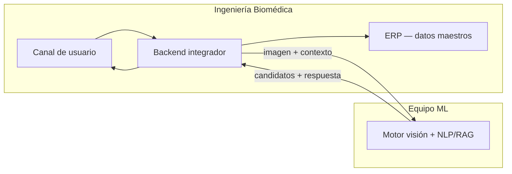
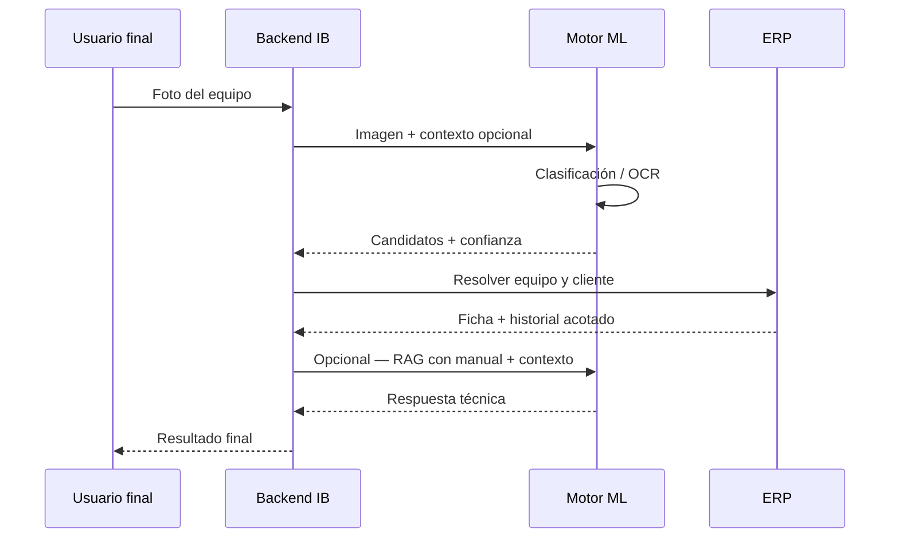

# Handoff técnico — Motor ML / Visión por computadora

> **Destinatario:** equipo de Machine Learning (motor de identificación y respuesta)  
> **Emisor:** Ingeniería Biomédica  
> **Fecha:** junio 2026  
> **Contacto:** Leandro Mongelos

---

## 1. Contexto del proyecto

Acordamos desarrollar, en conjunto, una capacidad de **identificación automática de equipos biomédicos a partir de imágenes** y de **generación de respuestas técnicas** apoyadas en manuales e historial.

### Roles de cada parte

| Parte | Responsabilidad |
|-------|-----------------|
| **Equipo ML (ustedes)** | Motor de visión (clasificación / detección), lectura de texto en imagen si aplica (OCR de placas/series), RAG o generación sobre manuales, API o contrato de integración del motor |
| **Ingeniería Biomédica (nosotros)** | ERP con parque instalado, aplicación o canal de usuario final, integración del motor ML, seguridad y acceso a datos |

El flujo de negocio previsto:

1. Un usuario final envía una **foto** de un equipo (desde la solución que implementemos nosotros).
2. Nuestro backend envía la imagen (y contexto acotado) al **motor ML**.
3. El motor devuelve candidatos de **marca / modelo / número de serie** y, opcionalmente, texto de respuesta.
4. Nosotros cruzamos ese resultado con el **ERP** (cliente, equipo instalado, historial) y mostramos la respuesta final.



Este documento describe **qué datos tenemos**, **cómo se relacionan clientes y equipos**, y **qué información pondremos a disposición para entrenamiento y pruebas**. Los detalles de acceso a entornos y credenciales se compartirán por **canal seguro aparte**.

---

## 2. Stack tecnológico (referencia general)

Resumen de alto nivel del ERP, útil para dimensionar integraciones. No incluye detalles de infraestructura ni despliegue.

| Capa | Tecnología |
|------|------------|
| **Frontend web interno** | Next.js, React, TypeScript |
| **Backend / API** | API REST en el mismo proyecto (TypeScript) |
| **Base de datos** | PostgreSQL |
| **ORM** | Prisma |
| **Autenticación** | Sesión con control de permisos por rol (solo usuarios autorizados) |

El motor ML puede ser independiente (Python, servicio cloud, contenedor, etc.). La integración con nosotros será por **contrato de API acordado** (entrada: imagen + metadatos opcionales; salida: identificación + confianza + texto).

---

## 3. Modelo de datos relevante para el motor ML

### 3.1 Relación Cliente ↔ Equipo

**No hay tabla intermedia de asignación.** La relación es **1 cliente : N equipos**:

- Cada registro de **equipo** tiene un `clienteId` obligatorio.
- Opcionalmente, un equipo puede estar asociado a una **sucursal** del mismo cliente (`sucursalId`).

Conceptualmente:

```
Cliente (1) ──< Equipos (N)
     │
     └──< Sucursales (N) ──< Equipos (opcional por sucursal)
```

### 3.2 Entidad Cliente — campos de interés

| Campo | Descripción | Uso para ML |
|-------|-------------|-------------|
| `id` | Identificador interno | Contexto en integración |
| `nombre` | Razón social | Contexto |
| `tipo` | Hospital, clínica, consultorio, etc. | Segmentación |
| `ciudad` | Localidad | Contexto geográfico |
| `activo` | Si el cliente está activo | Filtrar datos válidos |

*Datos de contacto comercial (CUIT, email, teléfono) existen en el ERP pero **no son necesarios para el motor ML**; no se incluirán en los exports de prueba salvo acuerdo explícito.*

### 3.3 Entidad Equipo — campos de interés (núcleo del ML)

| Campo | Descripción | Uso para ML |
|-------|-------------|-------------|
| `id` | Identificador interno | Resultado de matching |
| `nombre` | Nombre descriptivo | Etiqueta / display |
| `marca`, `modelo`, `modeloExacto` | Fabricante y modelo | **Target principal de clasificación visual** |
| `numeroSerie` | Serie de fábrica (única) | Validación / OCR |
| `estado` | Activo, en reparación, baja | Contexto de respuesta |
| `clienteId` | Cliente propietario | Acotar candidatos |
| `origen` | Venta, alquiler, externo, carga manual | Casuística de negocio |
| `inventarioId` | Vínculo al catálogo interno | Foto y descripción de referencia |

**Información asociada al equipo** (para enriquecer respuestas; la consume nuestro backend, no necesariamente el modelo de visión):

| Tipo | Contenido |
|------|-----------|
| Accesorios | Cables, sensores incluidos |
| Componentes | Baterías, filtros, calibraciones con fecha de vencimiento |
| Historial / bitácora | Instalación, servicios, notas técnicas |
| Catálogo vinculado | Descripción comercial, imagen de referencia del producto |

### 3.4 Catálogo de productos (inventario)

Equipos vendidos o alquilados por IB suelen vincularse a un ítem de catálogo con:

| Campo | Uso para ML |
|-------|-------------|
| `marca`, `modelo`, `nombre` | Etiquetas de entrenamiento |
| `descripcion` | Texto para embeddings / RAG |
| `fotoUrl` | **Imagen de referencia** para entrenamiento y validación |

> **Manuales PDF:** el ERP **no** centraliza hoy manuales de fabricante. Ustedes pueden mantener la base documental; nosotros aportamos **marca + modelo + identificadores** para enlazar resultados.

---

## 4. Datos de ejemplo — clientes ya cargados en el ERP

Los ejemplos siguientes corresponden a **clientes y equipos que el ERP ya crea al inicializar datos de demo** (`prisma/seed.ts`). Son instituciones reconocibles del rubro en Formosa; los **CUIT, emails y teléfonos del seed son ficticios** y **no se incluyen aquí**.

Si en **producción** cargaron clientes reales adicionales o modificaron registros, los **nombres pueden coincidir** pero los **identificadores internos (`id`) serán distintos**. Para pruebas con IDs reales, entregaremos un **export JSON/CSV** por canal seguro.

> **Nota sobre casuísticas:** el seed base asigna **3 equipos por cliente** con origen `VENTA`. Para el handoff ML, ejecutar el enriquecimiento idempotente y luego exportar:
>
> ```bash
> npm run db:seed              # si la BD está vacía
> npm run seed:ml-handoff      # EXTERNO, ALQUILER, MON-PAT-001, componentes, historia
> npm run export:ml-handoff    # genera docs/exports/ml-handoff-clientes-equipos.json
> ```
>
> El JSON **no incluye** CUIT, email, teléfono, contacto ni URLs de producción; el catálogo vinculado expone solo `tieneFotoReferencia` (boolean).

### Cliente 1 — Hospital Central Dr. Salvador Mazza

| Atributo | Valor |
|----------|-------|
| Tipo | `HOSPITAL` |
| Ciudad | Formosa Capital |
| Casuística | Parque con varios equipos; estados **ACTIVO** y **EN_REPARACION**; incluye demo de **historia clínica** y componentes con vencimiento en el primer equipo |

**Equipos (seed):**

| Equipo | Marca | Modelo | N° serie | Estado |
|--------|-------|--------|----------|--------|
| Respirador Mecánico | Dräger | Savina 300 | DRG-1000 | ACTIVO |
| Incubadora Neonatal | Dräger | Caleo 8000 | DRC-1001 | EN_REPARACION |
| Monitor Multiparamétrico | Mindray | iMEC 8 | MND-1002 | ACTIVO |

**Desafío ML:** varios equipos en el mismo cliente; conviene acotar candidatos por `clienteId` cuando el contexto lo permita.

---

### Cliente 2 — Clínica San Juan

| Atributo | Valor |
|----------|-------|
| Tipo | `CLINICA` |
| Ciudad | Formosa Capital |
| Casuística | Clínica privada con parque estándar; el ERP además tiene en catálogo un **Mindray ePM 12** (`MON-PAT-001`) usable como referencia visual al vincular ventas |

**Equipos (seed):**

| Equipo | Marca | Modelo | N° serie | Estado |
|--------|-------|--------|----------|--------|
| Autoclave | Azteca | NS100 | AZT-1006 | ACTIVO |
| Oxímetro de Pulso | Nellcor | PM10N | NEL-1007 | EN_REPARACION |
| Bomba de Infusión | BD | Alaris CC | BD-1008 | ACTIVO |

**Desafío ML:** validar identificación en entorno clínico ambulatorio; caso favorable cuando el equipo esté vinculado al ítem de catálogo con foto.

---

### Cliente 3 — Consultorio Dr. Ramón Espínola

| Atributo | Valor |
|----------|-------|
| Tipo | `CONSULTORIO` |
| Ciudad | Clorinda |
| Casuística | Cliente pequeño; escenario típico de equipos **EXTERNO** (carga manual por servicio técnico, sin catálogo IB) |

**Equipos (seed):**

| Equipo | Marca | Modelo | N° serie | Estado |
|--------|-------|--------|----------|--------|
| Ecógrafo Portátil | GE | Vscan Extend | GE-1015 | ACTIVO |
| Autoclave | Azteca | NS100 | AZT-1016 | EN_REPARACION |
| Oxímetro de Pulso | Nellcor | PM10N | NEL-1017 | ACTIVO |

**Desafío ML:** sin foto de catálogo interna; el modelo debe apoyarse en visión + metadatos del equipo.

---

### Cliente 4 — Hospital Distrital de Clorinda

| Atributo | Valor |
|----------|-------|
| Tipo | `HOSPITAL` |
| Ciudad | Clorinda |
| Casuística | Sede fuera de capital; parque hospitalario estándar |

**Equipos (seed):**

| Equipo | Marca | Modelo | N° serie | Estado |
|--------|-------|--------|----------|--------|
| Bomba de Infusión | BD | Alaris CC | BD-1018 | ACTIVO |
| Electrocardiógrafo | Mortara | ELI 150c | MRT-1019 | EN_REPARACION |
| Respirador Mecánico | Dräger | Savina 300 | DRG-1020 | ACTIVO |

**Desafío ML:** identificación en hospital de zona; componentes con vencimiento se consultan desde nuestro backend cuando existan en la ficha.

---

### Cliente 5 — Centro de Diagnóstico Médico Formosa

| Atributo | Valor |
|----------|-------|
| Tipo | `CLINICA` |
| Ciudad | Formosa Capital |
| Casuística | Centro de diagnóstico; el modelo soporta equipos en **ALQUILER** además de venta (a incluir en export enriquecido) |

**Equipos (seed):**

| Equipo | Marca | Modelo | N° serie | Estado |
|--------|-------|--------|----------|--------|
| Monitor Multiparamétrico | Mindray | iMEC 8 | MND-1012 | ACTIVO |
| Electrobisturí | Valleylab | FT10 | VLB-1013 | EN_REPARACION |
| Desfibrilador | Philips | HeartStart XL+ | PHI-1014 | ACTIVO |

**Desafío ML:** equipos de imagen/diagnóstico y terapia; distinguir alquiler vs propiedad es lógica de negocio posterior al reconocimiento visual.

---

### Otros clientes ya en el ERP (seed)

| Nombre | Tipo | Ciudad |
|--------|------|--------|
| Hospital de la Madre y el Niño | HOSPITAL | Formosa Capital |
| Sanatorio del Norte | SANATORIO | Formosa Capital |
| Clínica Riviera | CLINICA | Formosa Capital |
| Centro Médico El Palmar | OTRO | Las Lomitas |
| Consultorio Dental Formosa | CONSULTORIO | Formosa Capital |

Cada uno tiene **3 equipos** asociados en el seed (30 equipos en total).

### Resumen de casuísticas

| # | Cliente en plataforma | Casuística clave |
|---|------------------------|------------------|
| 1 | Hospital Central Dr. Salvador Mazza | Parque grande, estados mixtos, historia clínica demo |
| 2 | Clínica San Juan | Clínica privada + catálogo Mindray de referencia |
| 3 | Consultorio Dr. Ramón Espínola | Consultorio chico, equipos externos |
| 4 | Hospital Distrital de Clorinda | Hospital zona Clorinda |
| 5 | Centro de Diagnóstico Médico Formosa | Diagnóstico; alquiler vs venta en export |

---

## 5. Acceso a datos y APIs (alcance para pruebas)

Dispondremos de **tres recursos lógicos** para que puedan probar e integrar:

| Recurso | Contenido |
|---------|-----------|
| **Clientes** | Listado y detalle (metadatos acotados) |
| **Equipos** | Ficha por equipo: marca, modelo, serie, estado, cliente |
| **Asignación** | Equipos asociados a cada cliente (consulta por cliente o por equipo) |

### Formato de entrega para el equipo ML

**Export estático (disponible en repo tras `npm run export:ml-handoff`):**

| Archivo | Contenido |
|---------|-----------|
| `docs/exports/ml-handoff-clientes-equipos.json` | 5 clientes handoff con equipos, **historial de asignaciones** por equipo + bloque `otrosClientes` (resumen) |

Estructura (schemaVersion 2):

```json
{
  "generatedAt": "...",
  "schemaVersion": 2,
  "clientes": [{
    "id", "nombre", "tipo", "ciudad", "activo",
    "equipos": [{
      "id", "nombre", "marca", "modelo", "numeroSerie", "estado", "origen",
      "asignacionActivaId": "...",
      "asignaciones": [{
        "id", "clienteId", "clienteNombre", "sucursalNombre",
        "tipo": "VENTA | ALQUILER | TRASLADO | ...",
        "vigenciaDesde", "vigenciaHasta", "activa", "motivo"
      }],
      "inventario?": { "sku", "nombre", "marca", "modelo", "descripcion", "tieneFotoReferencia" }
    }]
  }],
  "otrosClientes": [{ "id", "nombre", "tipo", "ciudad", "activo", "cantidadEquipos" }]
}
```

**Uso ML:** filtrar candidatos por `clienteId` del contexto usando `asignacionActivaId` / fila con `activa: true`. El historial permite enriquecer respuestas (“antes estaba en otro hospital”) sin multi-cliente simultáneo.

Acordaremos además uno o más de estos canales (sin publicar URLs ni credenciales en este documento):

1. **Export estático** (JSON) — generado localmente con el script anterior; ideal para entrenamiento inicial.
2. **Entorno de prueba aislado** con API REST de solo lectura — ideal para integración del motor.
3. **Imágenes de referencia** del catálogo (cuando existan) asociadas a marca/modelo.

### Contrato de integración del motor (propuesta)

Entrada sugerida hacia su servicio:

```json
{
  "imagen": "<base64 o URL temporal firmada>",
  "contextoOpcional": {
    "clienteId": "...",
    "candidatosMarcaModelo": []
  }
}
```

Salida sugerida:

```json
{
  "candidatos": [
    {
      "marca": "Mindray",
      "modelo": "ePM 12",
      "numeroSerieDetectado": "MND-1042",
      "confianza": 0.92
    }
  ],
  "respuestaTexto": "..."
}
```

Los detalles finales (formato, límites de tamaño, timeouts) se definen en reunión técnica.

### Seguridad

- **No compartimos** en documentación pública: URLs de producción, credenciales, nombres de cookies, claves de API, rutas internas de administración ni detalles de infraestructura.
- El acceso a datos reales será **solo lectura**, en **sandbox**, con credenciales **rotables** y entregadas por canal privado.
- Toda comunicación entre sistemas usará **HTTPS** y autenticación acordada (token de servicio, mTLS, etc.).

---

## 6. Flujo de integración previsto



---

## 7. Próximos pasos

| Tema | Acción |
|------|--------|
| Export de datos de prueba | IB entrega JSON/CSV con 5+ clientes y equipos |
| Acceso sandbox API | IB habilita entorno aislado; credenciales por canal seguro |
| Contrato API del motor ML | Definir request/response, SLA y formatos |
| Imágenes de entrenamiento | IB aporta fotos de catálogo; ML define necesidades adicionales |
| Manuales | ML indexa documentación; IB aporta mapeo marca/modelo |
| Feedback | Canal para correcciones de identificación y mejora continua |

---

## 8. Entregables acordados

| Entregable | Responsable | Estado |
|------------|-------------|--------|
| Modelo de datos Cliente ↔ Equipo | IB | ✅ Documentado en este archivo |
| Tablas de ejemplo (5+ clientes, casuísticas) | IB | ✅ §4 + `npm run export:ml-handoff` |
| APIs de consulta (clientes, equipos, asignación) | IB | ⏳ Sandbox + credenciales por canal seguro |
| Motor ML (visión + respuesta) | Equipo ML | ⏳ En desarrollo |
| Integración en canal de usuario | IB | ⏳ Posterior al motor |

---

*Documento preparado para handoff al equipo de Machine Learning — Ingeniería Biomédica.*
